::: {.callout-note collapse="true"}
## Resources: `RStudio`
- [Posit RStudio](https://posit.co/products/open-source/rstudio)
- [R4DS RStudio](https://r4ds.hadley.nz/intro.html#rstudio)
- [Cheatsheet page](https://rstudio.github.io/cheatsheets/html/rstudio-ide.html)
- [Cheatsheet PDF](https://rstudio.github.io/cheatsheets/rstudio-ide.pdf)
- Fávero, L. P., Belfiore, P., & De Freitas Souza, R. (2023). Introduction to R-based language. In *Data Science, Analytics and Machine Learning with R* (pp. 7–25). Elsevier. <https://doi.org/10.1016/B978-0-12-824271-1.00033-0>
:::

::: callout-tip
## Go: You have already run R code

In [How Code Builds a Plot](layers.qmd), you ran R code in your web browser. In this chapter you put R on your own computer, so that you can run code with your own data, save your work, and write your reports.
:::

## What is R and RStudio?

*R* is a programming language used for statistical computing and quantitative data analysis. *RStudio* is a user-friendly interface that makes it easier to write and run R code. R performs the computations, data manipulation, and calculations, while RStudio provides tools that help you organize and execute your code. You will need both *R* and *RStudio* on your computer to do quantitative data analysis. Once you download both *R* and *RStudio* programs, you will NOT need to open and use *R*. You will use *RStudio* to do all of your computational programming. 

Things you can do in RStudio:

- Run commands
- Perform statistical analysis tests
- Make plots
- Publish reports
- Clean and manipulate data
- Create interactive websites

## Downloading R and RStudio

Because RStudio runs on top of R, R must be installed **before** installing and using RStudio.

### Download R

1.  Go to the following website: <https://posit.co/download/rstudio-desktop/>

2.  Scroll down to and click "Download and Install R". This will bring you to the R Project website page.

    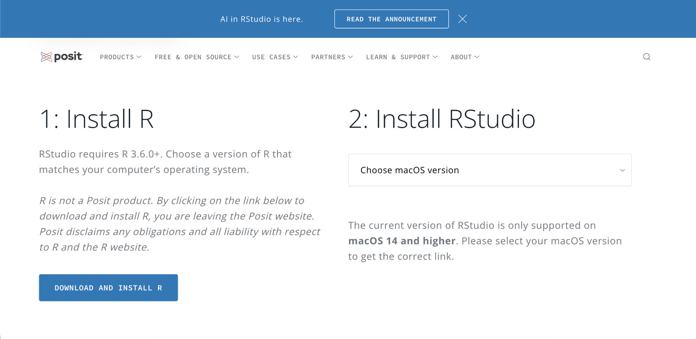{fig-alt="Posit download page showing two steps: 1 Install R, with a Download and Install R button, and 2 Install RStudio, with a drop-down menu to choose your operating system version."}

3.  From here, select the "Download R for \_\_\_\_" option for your computer software.

    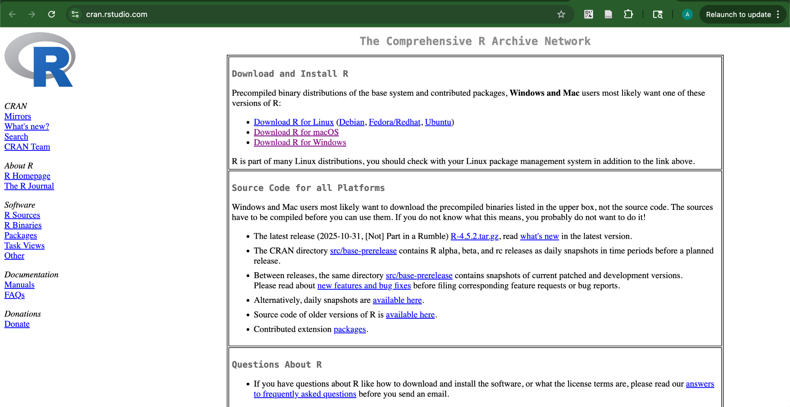{fig-alt="CRAN home page with links to Download R for Linux, Download R for macOS, and Download R for Windows."}

4.  Follow the instructions below depending on your software.

#### Mac

1.  Click "Download R for macOS."

2.  Download the specific package depending on your chip/processor.

    ::: callout-tip
    ## Hint: Apple silicon or Intel?

    To see if your Mac is silicon or Intel, go to the Apple icon on the top left corner and select *About This Mac*. If you see **Chip** followed by Apple M1, M2, M3, or M4, it is silicon; if it says **Processor** followed by Intel Core, it is Intel.
    :::

    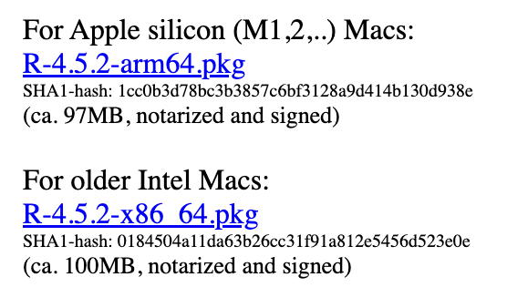{fig-alt="CRAN macOS page listing R-4.5.2-arm64.pkg for Apple silicon (M1, M2, and later) Macs and R-4.5.2-x86_64.pkg for older Intel Macs." width="70%"}

3.  Follow the steps on your Mac to finish downloading the package. This is similar to how other apps would be downloaded.

    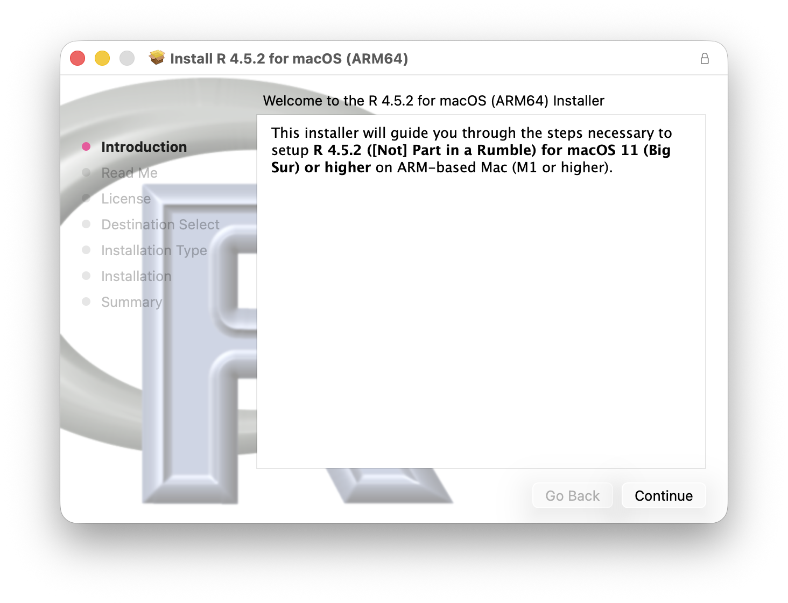{fig-alt="Welcome screen of the R 4.5.2 for macOS installer with a Continue button." width="70%"}

    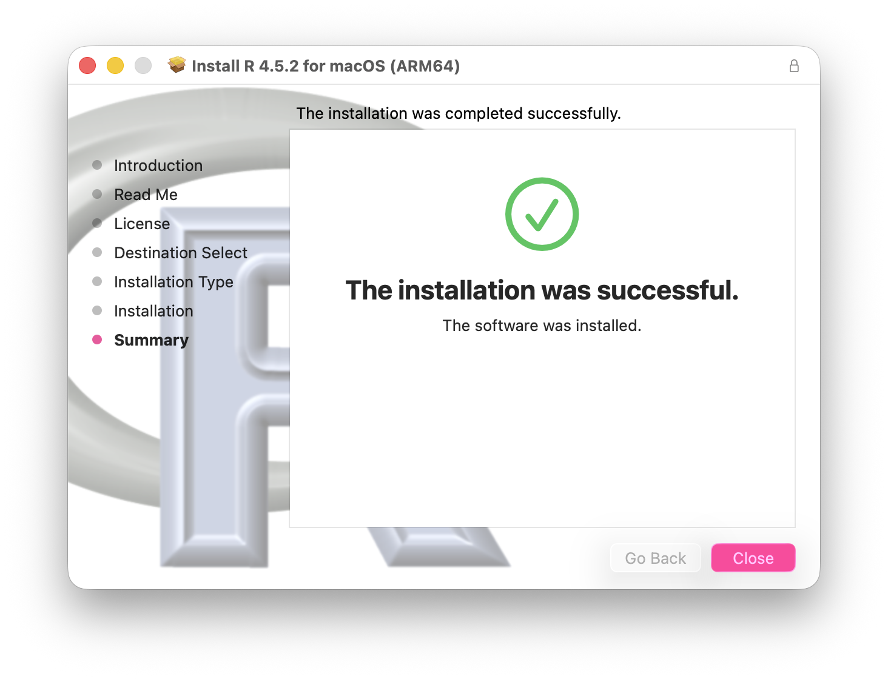{fig-alt="Final screen of the R installer for macOS with a green check mark and the message: The installation was successful." width="70%"}

#### Windows

1.  Click "Download R for Windows."

2.  Click "install R for the first time."

    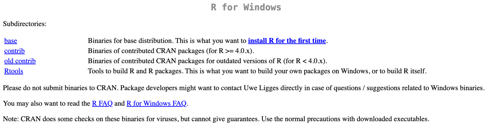{fig-alt="CRAN R for Windows page with subdirectories base, contrib, old contrib, and Rtools. The base row includes the link: install R for the first time."}

3.  Click the "Download R-4.x.x for Windows" link at the top of the page (the version number changes over time).

4.  Open the file and follow the steps on your computer to finish downloading the package.

### Download RStudio

1.  Go back to the Posit website: <https://posit.co/download/rstudio-desktop/>

2.  Scroll down to "Install RStudio."

    {fig-alt="Posit download page showing two steps: 1 Install R, and 2 Install RStudio, with a drop-down menu to choose your operating system version."}

3.  If the page shows a drop-down, select the option that matches your computer's operating system version.

    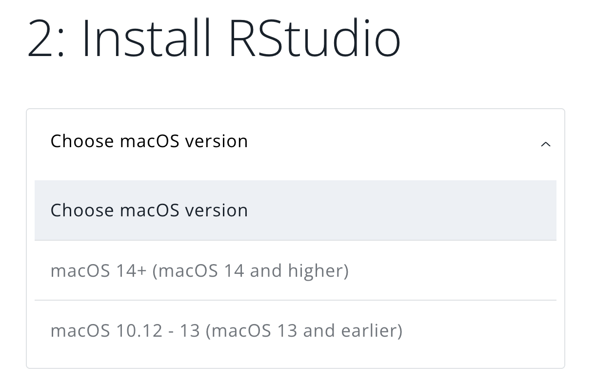{fig-alt="Install RStudio drop-down menu open with two options: macOS 14+ and macOS 10.12 - 13." width="70%"}

4.  Press "Download RStudio Desktop for \_\_\_\_\_\_\_."

    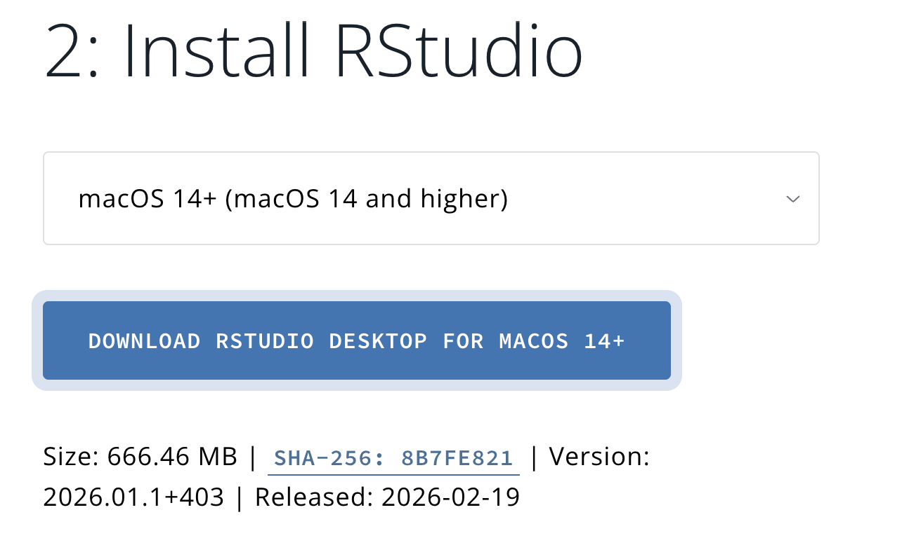{fig-alt="Install RStudio section with macOS 14+ selected and a blue button labeled Download RStudio Desktop for macOS 14+." width="70%"}

5.  For both Mac and Windows, finish downloading RStudio by following the prompts on your computer, similar to how other apps are downloaded.

6.  You have now downloaded RStudio. Open RStudio, and it should look like this:

    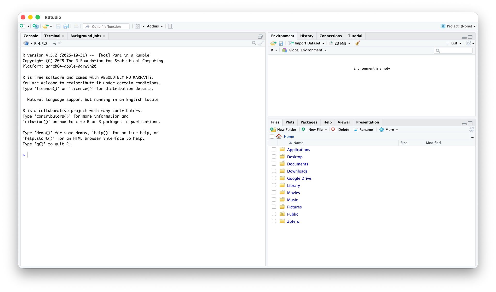{fig-alt="RStudio window on first launch with three panels: the console on the left, the environment on the upper right, and the files tab on the lower right."}

## Navigating the Layout

When you open RStudio, the default window looks like the image below. You will see four main panels.

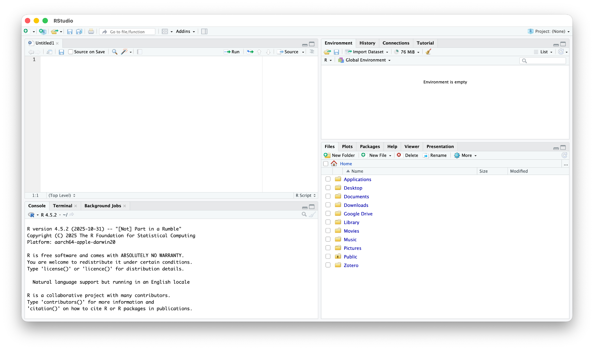{#fig-rstudio-panels fig-alt="RStudio window with four panels: the script editor on the upper left, the console on the lower left, the environment on the upper right, and the files, plots, packages, and help tabs on the lower right."}

The lower left corner has three important tabs. The main section here is the **console**. Commands can be typed directly into this section and R will execute them immediately. All code executed during each R session will be displayed in this section, along with any outputs. Any errors that may happen will also appear here. It is important to note that any work in the console does not get saved. In order to save code, it must be written in the script editor. The **terminal** is another tab located in this section. In this class, the terminal is used to publish our reports as Quarto websites. The **background jobs** tab shows longer tasks that RStudio runs in the background, such as rendering or previewing a Quarto document.

The **script editor** is in the upper left corner. A script is a file that contains code. Commands can be typed into the script to be saved and returned to later. When commands are run in the script editor, their outputs will appear in the console.

The upper right corner is the **environment tab**. Any objects created and saved in R will appear here. For example, we will see any imported or created data sets and variables. This panel also contains the **history tab**, which keeps a list of the commands you have run.

There are many tabs located in the lower right corner. The **files tab** allows us to navigate files and folders in the entire directory. This is where we will import any new files and data. The **plots tab** will display any graphs or images generated by code in the current session. The **packages tab** lists all the installed R packages. The **help tab** provides R documents and tutorials for functions and packages.

## Scripts and Quarto Documents

A script is a text file that contains code. It allows us to enter commands and save our work, then return to it later. Unlike the console, where commands run immediately and are not saved, scripts allow us to store a set of commands for future use or sharing.

### Creating and saving a new script

In the upper left hand corner, press the green icon with the plus sign, then click "R Script." A blank script will appear in the script editor.

To save a new script, press the single disk icon in the toolbar. A pop-up should appear to save the script. Name the file and save it to the appropriate place.

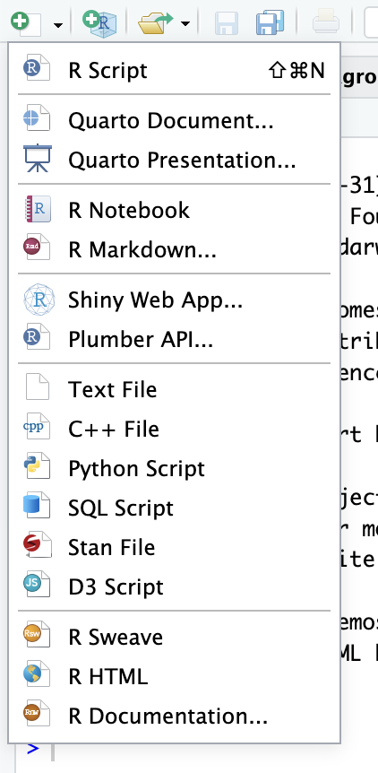{fig-alt="RStudio New File menu opened from the green plus icon, listing R Script, Quarto Document, Quarto Presentation, R Notebook, R Markdown, and other file types." width="35%"}

### RStudio Projects and the Working Directory

The **working directory** is the folder on your computer where R looks for files and saves new ones. If the file you want to import is not in the working directory, R will not be able to find it and you will see a "cannot open file" error.

The easiest way to manage the working directory is to let RStudio do it for you with an **RStudio Project**. A project is simply a folder on your computer that contains a small `.Rproj` file. Whenever you open the project, RStudio automatically sets the working directory to that folder. You will keep everything for your individual report — data files, R scripts, and Quarto documents — together in this one folder.

#### Create your project (do this once)

1.  Click File \> New Project...
2.  Choose **New Directory**, then **New Project**.
3.  For *Directory name*, type `Lastname_FRI` (using your own last name, with no spaces).
4.  For *Create project as subdirectory of*, click Browse and choose a place you can find again, such as your Documents folder.
5.  Click **Create Project**. RStudio restarts inside your new project.

You will know you are in your project when its name (`Lastname_FRI`) appears in the top right corner of RStudio, and the **files tab** shows the contents of your project folder, including the file `Lastname_FRI.Rproj`.

#### Open your project (do this every time)

Always start your work by opening the project, not an individual file. You can either:

- double-click the `Lastname_FRI.Rproj` file in your project folder (Finder on Mac or File Explorer on Windows), or
- in RStudio, click File \> Open Project... (or use the project menu in the top right corner) and select your `.Rproj` file.

To confirm that the working directory is your project folder, copy and paste this code into the console (which is the tab in the bottom left corner of RStudio) and then press "return" (on a mac) and "enter" on a windows computer:

``` r
getwd()
```

#### Keep your files in the project folder

Move or download your data files into your project folder. They will then show up in the files tab. Save your R scripts and Quarto documents in the same folder.

Because the working directory is the project folder, you can import data using just the file name:

``` r
read.csv("alldata_vaccinations.csv")
```

::: callout-important
## Important: Save your Quarto documents in the project folder

When a Quarto document (`.qmd`) is rendered, R looks for data files starting from the folder where the `.qmd` file is saved. If your `.qmd` file and your data file are both in your project folder, the file name alone will work in the console and when you render.
:::

::: callout-warning
## Avoid `setwd()` and full file paths

You may see code that sets the working directory by hand or imports a file with its full location on one person's computer:

``` r
setwd("/Users/yourname/FRI")
read.csv("/Users/yourname/Downloads/alldata_vaccinations.csv")
```

This code only works on that one computer. It will fail on your teammates' computers and on your instructor's computer, because the folder `/Users/yourname/` does not exist there. With a project and file names only, the same code runs for everyone who has the project folder.
:::

::: callout-tip
## Start each session with a clean slate

Go to Tools \> Global Options \> General. Under *Workspace*, uncheck "Restore .RData into workspace at startup" and set "Save workspace to .RData on exit" to **Never**. This way, your results always come from the code in your script or Quarto document rather than from leftover objects.
:::

### Quarto

Quarto is a publishing system that allows us to combine text and code to produce reports, presentations and websites. Quarto documents are made using **`.qmd` files**. To open a `.qmd` file and begin a Quarto document, press the green plus sign in the upper left hand corner, then click "Quarto Document." Quarto documents are saved the same way as scripts.

Text written normally in Quarto appears as regular text in the output. In order to include and run code in our final reports, code must be written in code chunks.

The first time you render a Quarto document, RStudio may ask to install packages it needs (such as `rmarkdown` and `knitr`). Click Yes.

### Running code

Code in the script can be sent to the R console for execution.

- To run the whole script: press the "Source" button on the upper right of the script editor (or select all of the code and press "Run").
- To run one or a few lines: highlight the code you want to run, then press the "Run" button, or use the shortcut, Cmd + Enter (Mac) / Ctrl + Enter (Windows).

### Organizing scripts

We can organize our scripts by including comments, using the `#` symbol. Any text in the line after the symbol will appear in the console, along with the following code and output, but will not be executed. As our script begins to fill up, it can get confusing knowing what each piece of code is for. If we use the `#` symbol above each section of code, we can note the purpose of the code. Additionally, when executing code, we may run into errors. The `#` symbol will help us locate the errors from the console in the scripts.

### Common errors

As you begin working in RStudio, you may encounter some errors. These are normal and can usually be fixed easily. A list of common errors is below:

- **Object not found** → This means that the object (such as a variable or dataset) has not been created yet. Make sure you have run the code that defines the object before trying to use it.
- **Cannot open file** → This usually means that RStudio cannot find the file you are trying to import. Check that you have opened your RStudio Project, that the file is in your project folder, and that the file name is spelled exactly right (including the file type, such as `.csv`).
- **Could not find function** → This error occurs when a function is not recognized. This is often because a package has not been loaded. Make sure you have run `library(thepackagename)` before using functions from that package.
- **There is no package called…** → This means the package has not been installed yet. Run `install.packages("thepackagename")` to install it, then `library(thepackagename)` to load it.

## Summary

### Terminology

- **Console**: The area where R runs code and displays output
- **Script**: A file where code is written and saved for later use
- **Object**: Any item created and stored in R, such as a variable, dataset, or result of a calculation
- **Working Directory**: The folder where RStudio looks for and saves files
- **RStudio Project**: A folder with an `.Rproj` file; opening it sets the working directory to that folder automatically
- **Environment**: Displays all objects (such as variables and datasets) created during a session
- **Package**: A collection of functions and tools that extend R's capabilities
- **Function**: A command that performs a specific task
- **Quarto Document**: A file used to create reports that combine code, output, and text
