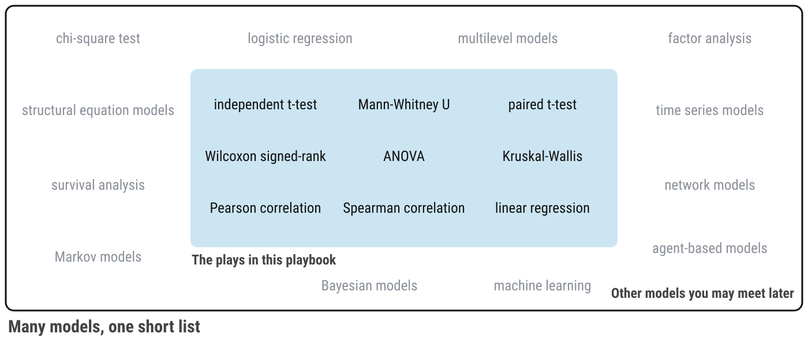

::: {.callout-note collapse="true"}
## Resources

-   [Barroga & Matanguihan (2022). A practical guide to writing quantitative and qualitative research questions and hypotheses](https://pubmed.ncbi.nlm.nih.gov/35470596/)
:::

## The Map

{.column-page fig-alt="A flowchart. Your research question leads to Describe Your Data, where you check whether your outcome is normal. From there one arrow leads to Compare Groups and one to Examine Relationships. Under Compare Groups: Visualize a Comparison, then Compare 2 Groups (independent t-test or Mann-Whitney U), Compare 1 Group, Pre/Post (paired t-test or Wilcoxon signed-rank), and Compare 3+ Groups (ANOVA or Kruskal-Wallis). Under Examine Relationships: Visualize a Relationship, then Relate 2 Variables (Pearson or Spearman correlation) and Relate 3+ Variables (linear regression). In each box the first test is for normal data and the second is for data that are not normal."}

Click the map to make it bigger.

## How to Read the Map

Start at the top left with your research question, and follow the arrows. Every name in blue is a chapter in this playbook. There are four steps.

1.  **Describe Your Data.** Make a descriptives table and a histogram of the outcome (the score) in your research question. Decide whether the histogram is roughly bell-shaped (normal) or not. Remember your answer. You will need it at step 4.
2.  **What kind of question is it?** Decide whether you are comparing groups or examining a relationship (see below).
3.  **Visualize.** Make the plot that fits your question: [Visualize a Comparison](visualize-comparison.qmd) or [Visualize a Relationship](visualize-relationship.qmd). Always look at your data before you test it.
4.  **Choose your test.** Find the box that matches your question. Each box lists two tests. If your data is normal, use the first one (the parametric test). If your data is not normal, use the second one (the non-parametric test).

::: {.callout-warning}
## Caution: The map is for outcomes that are scores

Every test on the map needs an outcome that is a score (a continuous variable), such as a composite from 1 to 5. If your outcome is a category, such as yes or no, you need a different test (chi-square). Talk to your instructor.
:::

## Comparison or Relationship?

Your research question can be classified as **comparative** research or **relationship** research ([Barroga & Matanguihan, 2022](https://pubmed.ncbi.nlm.nih.gov/35470596/)).

### Comparison Research {#comparative-research}

Comparative research questions examine mean score differences on a continuous (quantitative) variable based on real or artificial (researcher-decided) group membership. Simply put, comparative research offers a way of comparing different categories to one another. These categories can be:

- 🏷️ **Nominal Data** (Racial/Ethnic Identity)

  - American Indian/Alaska Native
  - Asian
  - Black/African American
  - Hispanic/Latinx
  - Middle Eastern/North African
  - Native Hawaiian/Pacific Islander
  - White
  - Two or more

- 📶 **Ordinal Data** (Age Group)

  - 18 - 35
  - 36 - 54
  - 55 - 75
  - 76+

### Relationship Research {#relationship-research}

For relationship research, the variables are 📏 **Continuous** because they range along a continuum, such as a scale for beliefs from 1 (strongly disagree) to 6 (strongly agree).  to build a custom scatterplot.

## Understanding Data Types

To read the map, you need to know what type of data each of your variables is:

**Qualitative Data:**

- 🏷️ **Nominal Data**: Categories without any order (e.g., Red, Green, Blue)

- 📶 **Ordinal Data**: Categories with some order (e.g., Small, Medium, Large)

**Quantitative Data:**

- 🔢 **Discrete**: Countable data (e.g., number of people in a room)

- 📏 **Continuous**: Measurable data (e.g., height, weight)

## 🏈 The Lab {#sec-map-lab}

:::::: {.ref .ref-tip}
::: ref-face
{fig-alt="Ref the raccoon"}
:::

::: ref-say
**Ref's kickoff.** There is no code in this lab. Read each research question about the lab dataset and decide: is it a **comparison** or a **relationship**, and which box on the map does it land in? Decide **before** you open my check.
:::
::::::

1.  Is age (`AGE`) related to the belief that substance use causes mental illness (`MIAQ_SUBSTANCE`)?
2.  Is mental health stigma (`STIGMA`) related to mental health self-efficacy (`EFFICACY`)?
3.  Does the belief that mental health is social (`SOCIAL`) differ between people on the political left, moderates, and people on the political right?
4.  Does willingness to seek help (`HELPSEEK`) differ between women and men?
5.  Did stigma (`STIGMA`) change between the first survey and the follow-up survey for the same people?

::: {.callout-tip collapse="true" icon="false"}
## {.ref-mini fig-alt="Ref the raccoon"} Ref's check: where does each question land on the map?

1.  **Relationship**, Relate 2 Variables. Both variables are scores.
2.  **Relationship**, Relate 2 Variables. Both variables are scores.
3.  **Comparison**, Compare 3+ Groups. The groups are left, moderate, and right. The outcome is a score.
4.  **Comparison**, Compare 2 Groups. Women and men are different people. `HELPSEEK` is a single 1-to-5 item, so it counts as not normal: use the second test in the box, Mann-Whitney U.
5.  **Comparison**, Compare 1 Group, Pre/Post. The same people answered before and after.
:::

:::::: {.ref .ref-tip}
::: ref-face
{fig-alt="Ref the raccoon"}
:::

::: ref-say
**Ref's final whistle.** That is the end of the lab. You will make the plots for questions 1, 2, and 3 in the two visualize chapters.
:::
::::::

## 🏆 Your Turn {#sec-map-yourturn}

::: {.callout-note .gray icon="false"}
## There is no Ref. It's game time, your turn!

Nobody has analyzed your team's data before, so there is no answer to check against. Use the map to write your own data analysis plan.
:::

Do this once for **each** of your research questions. Copy the sentences below into the *Data Analysis Plan* heading of your methods section and fill in the blanks.

> My research question is: \_\_\_\_\_\_\_\_.
>
> This is a \_\_\_\_\_\_\_\_ (comparison / relationship) question. My outcome is \_\_\_\_\_\_\_\_, which is a continuous variable. My \_\_\_\_\_\_\_\_ (grouping variable / second variable) is \_\_\_\_\_\_\_\_, which is a \_\_\_\_\_\_\_\_ (nominal / ordinal / continuous) variable.
>
> On the Analysis Map, my question lands in the box \_\_\_\_\_\_\_\_. I will visualize my data with a \_\_\_\_\_\_\_\_ (barplot / violin plot / scatterplot). The histogram of my outcome is \_\_\_\_\_\_\_\_ (normal / not normal), so I will use the \_\_\_\_\_\_\_\_ test.

## Many Models, One Short List {#many-models}

The Analysis Map is short on purpose. In *The Model Thinker*, Scott Page ([2018](https://sites.lsa.umich.edu/scottepage/home/the-model-thinker/)) argues that data does not explain itself. People move from data to information, from information to knowledge, and from knowledge to wisdom by using **models**: simplified, formal ways of describing how something works. Every model leaves things out, so no single model is ever the full story. Page's advice is to become a **many-model thinker**: learn several models, know what each one assumes, and look at the same problem through more than one of them.

The statistical tests on the Analysis Map are models, too. A t-test is a model of two groups. A regression is a model of a straight line. They are the right models for the research questions in this course, and they are the only ones you will choose from for your *RD Report* and *Final Report*. They are not the only ones that exist. Logistic regression, multilevel models, network models, machine learning, and many others answer questions that these tests cannot. If your question does not fit the map, that does not mean it is a bad question. It means it needs a different model, so talk to your instructor. You can find places to keep learning in [Statistics](statistics.qmd).

{fig-alt="Nine statistical tests from the Analysis Map sit inside a blue panel labeled the plays in this playbook: independent t-test, Mann-Whitney U, paired t-test, Wilcoxon signed-rank, ANOVA, Kruskal-Wallis, Pearson correlation, Spearman correlation, and linear regression. Around the panel, in gray, are twelve other kinds of models, such as chi-square, logistic regression, multilevel models, network models, and machine learning, labeled other models you may meet later."}

**Reference**

Page, S. E. (2018). [*The model thinker: What you need to know to make data work for you*](https://sites.lsa.umich.edu/scottepage/home/the-model-thinker/). Basic Books.
