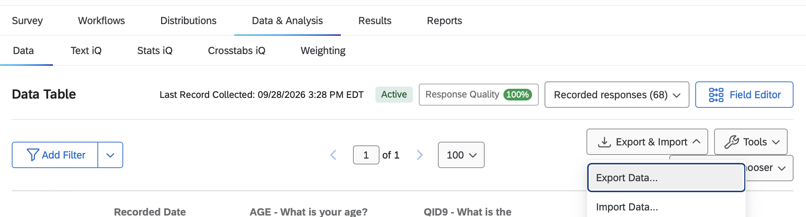
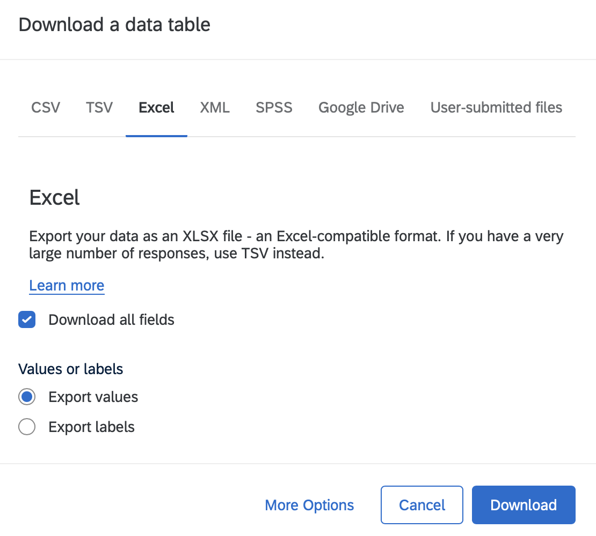
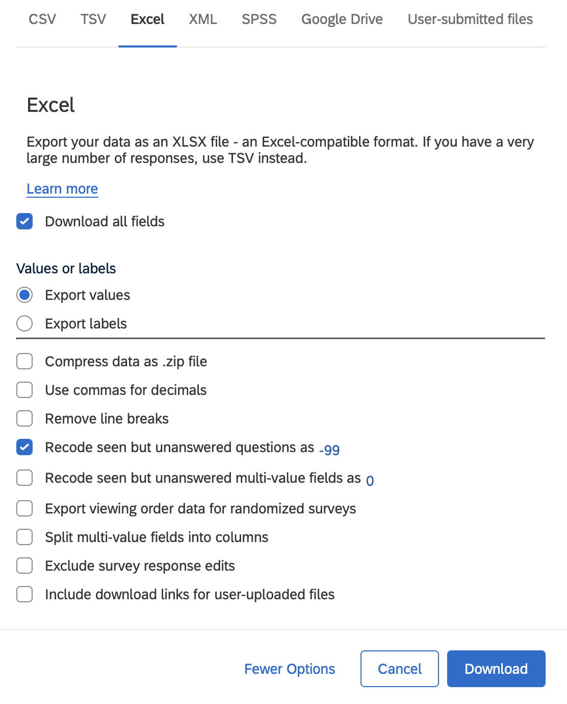

```{r}
#| label: set-export-date
#| include: false
export_date <- "10.09.2026"   # this year's export date (the October 9 lecture); change it here and every file name in the chapter updates
```

Some researchers collect data via survey software, such as Qualtrics and REDCap. This chapter is the export itself: the final Word copy of the survey questions, then the data as an Excel file, then a clean copy of that file with one header row. The naming and recoding that must come first are in [Name and Recode Variables in Qualtrics](qualtrics.qmd).

::: {.callout-important .required}
## Required: triple-check the coded values before you export any data

Go back to [Name and Recode Variables in Qualtrics](qualtrics.qmd) and **triple-check** that the exported survey questions show a numerical value for every response option, based on your team's meeting and your final review. Once the data are exported and people start their individual reports, a wrong or missing number cannot be fixed. This is the step that is irreversible later on.
:::

## Export the Final Survey Questions (`.docx`)

You exported a draft of the survey questions right after your team's recoding meeting. Now export the **final** version, after every last change to the survey, so that the document on Google Drive matches the data you are about to download.

-   [ ] Log into Qualtrics: <https://binghamton.co1.qualtrics.com>
    -   [ ] Under Active surveys, click on your survey
-   [ ] Click on Survey \> Import/Export \> **Export Survey to Word**. In the dialog, make sure **Show coded values** is checked ([how to](qualtrics.qmd#sec-export-word)), then click **Export**.
-   [ ] Open the file in Microsoft Word (not Google Docs). Every answer choice must show its number in parentheses, for example "Poor (1)", and the numbers must match your team codebook. If any are missing, go back to Recode values in Qualtrics, fix them, **Publish**, and export again.
-   [ ] Save it as `Final.TeamSurveyQuestions.docx`.
-   [ ] Open your **TEAM DRIVE: Team Survey Data folder** and click + New \> File Upload and select your document.
-   [ ] Open your `TeamCodebook.docx` in the same folder and update any row that changed since the draft, so that the codebook and the final survey questions agree.

::: {.callout-important .required}
## Required: the final Word export and codebook, by the end of the October 9 lecture

By the end of the **October 9 lecture**, after your team's final review, your team's Google Drive should hold the final version of the Qualtrics survey questions, `Final.TeamSurveyQuestions.docx`, and an updated `TeamCodebook.docx` that matches it. (The draft versions, `Draft.TeamSurveyQuestions.docx` and the first `TeamCodebook.docx`, should already be there from the October 2 lecture; see [Name and Recode Variables in Qualtrics](qualtrics.qmd).) These are not graded. They are what your team, your peer mentors, and Dr. Shane will rely on when a number in the data needs explaining.
:::

## Export Survey Data (`.xlsx`)

- [ ] At the top, go to the **Data & Analysis** tab (top navigation bar) and make sure **Data** is selected (second navigation bar). You should see the Data Table with the number of recorded responses.
- [ ] On the upper right, click **Export & Import**, then **Export Data...**

{fig-alt="The Qualtrics Data & Analysis tab with Data selected, showing the Data Table with 68 recorded responses. The Export & Import menu at the upper right is open with Export Data... highlighted."}

- [ ] In the **Download a data table** dialog, click the **Excel** tab, keep **Download all fields** checked, and choose **Export values** (not Export labels). Values are the numbers you recoded in [Name and Recode Variables in Qualtrics](qualtrics.qmd); labels would export the words.
{fig-alt="The Download a data table dialog with the Excel tab selected. Download all fields is checked; under Values or labels, Export values is selected and Export labels is not. At the bottom are More Options, Cancel, and Download." width="70%"}

- [ ] Click **More Options** (bottom left). A list of checkboxes opens under the values/labels choice. Set two of them and leave the rest alone:
  - [ ] Check **Recode seen but unanswered questions as** and make sure the box next to it says **-99**. A question a person saw and skipped then exports as -99, the same code as *Prefer not to say*, and [Import Data Once](import-once.qmd) turns both into `NA` in one step. Without this, a skipped question exports as an empty cell, which R reads differently from -99 and which can hide how many people skipped.
  - [ ] Check **Split multi-value fields into columns** if your survey has any select-all question (for example, the select-all version of `RACIALIZED`). It is **off by default**. Checked, a select-all question exports as one column per box (`RACIALIZED_1` … `RACIALIZED_8`, `RACIALIZED_99`), which is what [Transforming Your Data](dplyr.qmd) expects. Leave **Recode seen but unanswered multi-value fields** unchecked: an unchecked box should export blank, not 0.
- [ ] Click **Download**.

{fig-alt="The More Options list in the Excel export dialog. Checked: Recode seen but unanswered questions as -99. Unchecked: Compress data as .zip file, Use commas for decimals, Remove line breaks, Recode seen but unanswered multi-value fields as 0, Export viewing order data for randomized surveys, Split multi-value fields into columns, Exclude survey response edits, Include download links for user-uploaded files. Buttons: Fewer Options, Cancel, Download." width="70%"}

- [ ] Upload the `.xlsx` file to your **TEAM DRIVE: Team Survey Data folder**, next to `Final.TeamSurveyQuestions.docx`.

## Rename Files and Download

- [ ] **Rename `.xlsx` file** using the date of the export in this format: MONTH.DAY.YEAR.team#.data.xlsx (the export) and MONTH.DAY.YEAR.team#.cleandata.xlsx (the clean copy). For example, if the date is `r export_date` then the correct format of the files should be: `r export_date`.team1.data.xlsx

- [ ] **Make a copy** of the `r export_date`.team1.data.xlsx and rename it to: `r export_date`.team1.cleandata.xlsx.

- [ ] In google sheets, **open up the file with .cleandata** added to the original file (i.e., `r export_date`.team1.cleandata.xlsx) and **delete the second row (with labels and questions/items)**. You'll notice that the dataset has two headers for variables and labels. You need to delete Row 2 to eliminate those labels.

- [ ] Go to File \> **Download** \> Microsoft Excel.

Once you have completed these steps, you can move to the next chapter to import your data (`r export_date`.team1.cleandata.xlsx) to R or NVivo.

::: {.callout-note .gray}
## 📁 Pre/post teams (Teams 3 and 5): one survey, one file

Your participants take the **same** Qualtrics survey twice, at pretest and at posttest, so there is one survey and **one** export, named like everyone else's (`r export_date`.team3.cleandata.xlsx). Two things have to be in it: the question that says which time a response is (the shared variable for pre/post teams in [Name and Recode Variables in Qualtrics](qualtrics.qmd)), and `PASSWORD`, which links a person's two rows ([Pre/Post Data](prepost.qmd)). Check both columns are there before you go on.
:::


::: callout-warning
## Caution: meet with a Quant Peer Mentor before you analyze your team data

After data collection ends and you have downloaded your team dataset, meet with a Quant Peer Mentor during lab before you go further. The quant PM lab schedule is in Column E of the [CLASS DRIVE: Student Lab Hours sheet](URL_STUDENT_LAB_HOURS).
:::

::: callout-tip
## Tips for Data Files

**Rename files** using the date of the export, following MONTH.DAY.YEAR.team#.data.xlsx (the export) and MONTH.DAY.YEAR.team#.cleandata.xlsx (the clean copy). For example, if you export on `r export_date` then the correct format of the files should be: `r export_date`.team1.data.xlsx. Then, `r export_date`.team1.data.xlsx should be changed to `r export_date`.team1.cleandata.xlsx after removing the second row.

It is important to include the date in your file names because you may download data at different stages of the recruitment process (e.g., after a brief pilot phase, halfway, and at the end). For example, a team that keeps collecting data after `r export_date` will export again at the end, and that later date goes in the file name of the final dataset (for example, 11.13.2026.team2.data.xlsx).
:::

::: {.callout-note .gray collapse="true"}
## 📁 Team 1 File Names

**Your files should be named:**

- `r export_date`.team1.data.xlsx
- `r export_date`.team1.cleandata.xlsx
:::

::: {.callout-note .gray collapse="true"}
## 📁 Team 2 File Names

**Your files should be named:**

- `r export_date`.team2.data.xlsx
- `r export_date`.team2.cleandata.xlsx
:::

::: {.callout-note .gray collapse="true"}
## 📁 Team 3 File Names

**Your files should be named:**

- `r export_date`.team3.data.xlsx
- `r export_date`.team3.cleandata.xlsx
:::

::: {.callout-note .gray collapse="true"}
## 📁 Team 4 File Names

**Your files should be named:**

- `r export_date`.team4.data.xlsx
- `r export_date`.team4.cleandata.xlsx
:::

::: {.callout-note .gray collapse="true"}
## 📁 Team 5 File Names

**Your files should be named:**

- `r export_date`.team5.data.xlsx
- `r export_date`.team5.cleandata.xlsx
:::

## Common Pitfalls to Avoid

::: {.callout-warning collapse="true"}
## ⚠️ Danger: Common Mistakes

- **Naming Files –** Make sure there are NO spaces anywhere in your file. Your file should be ONE object without spaces.
- **Double Check** – Make sure to double check everything at this stage of the process because there will be negative consequences later.
:::
