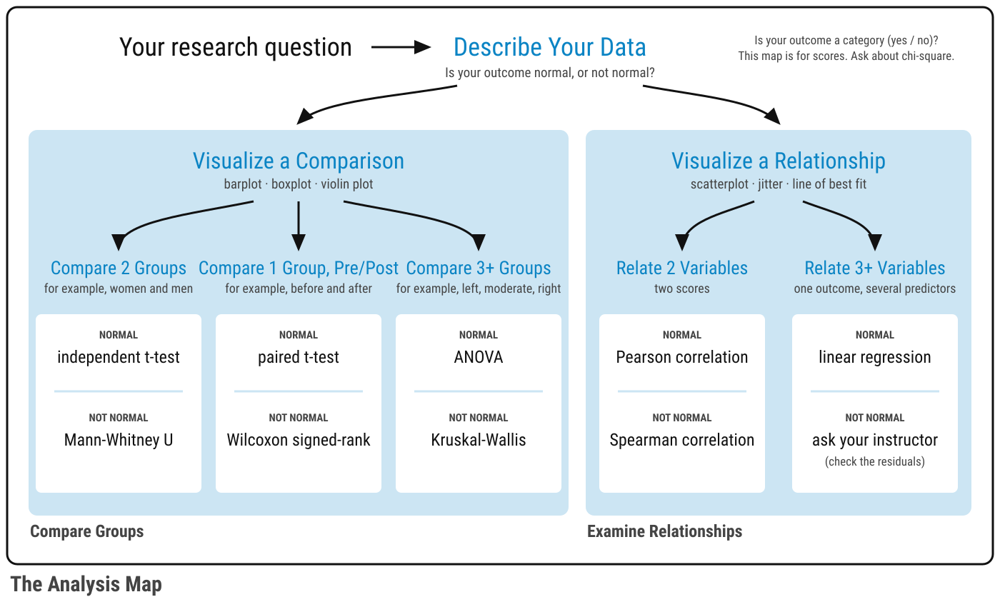

---
# These two labels change ONLY the Preface page (the book's title page). Chapters still say "Author(s)" and "Published".
language:
  title-block-author-single: "Editor"
  title-block-published: "Edition 2 (v2.01)"
---

# Preface {.unnumbered}

The most successful sports teams rely on well-designed plays to navigate complex game situations. The [FRI Public Health research stream at Binghamton University](https://fripublichealth.quarto.pub) uses strategic data analysis "plays" to tackle the multifaceted challenges of health promotion and disease prevention in our communities. Student research teams explore the biopsychosocial factors affecting human physical and mental health by collecting physiological data through wearables like the [MUSE S headband](https://choosemuse.com) and the [Fitbit Charge 6](https://community.fitbit.com/t5/Community/ct-p/EN), psychological and sociodemographic data through survey questionnaires in [Qualtrics](https://www.qualtrics.com) and interviews, and behavioral patterns through online experiments. Ultimately, our research aims to connect the dots between biological, social, political, commercial, and economic determinants of health behavior, outcomes, and inequities. To analyze quantitative data in R, the FRI Public Health Lab has created this playbook with a variety of "plays" (R code) for students in the quantitative data analysis track to use for their team-based research projects.

Like a coach calling the right play at the crucial moment, this playbook equips you and your research team with proven strategies from the tidyverse for importing data, tidying data in `tidyr`, transforming data in `dplyr`, visualizing data in `ggplot2`, modeling with `stats`, and writing reproducibly in `quarto` with R. Each "play" in this guide has been field-tested by research teams who have used quantitative techniques to answer pressing questions about physical and mental health.

You do not need to memorize the whole playbook. **The Analysis Map** takes you from your research question to the right plot and the right statistical test, so you only study the plays you need. Each chapter then teaches its play three times: you watch it (**The Play**), you practice it with a shared dataset (**The Lab**), and you run it with your own team's data (**Your Turn**).

Whether you are facing a dataset for the first time or refining your analytical strategy, this playbook helps you turn data into information, information into knowledge, and knowledge into wisdom in order to improve community health.

## The Purpose of the Course {.unnumbered}

The purpose of the FRI Public Health courses is to develop your research skills: the conceptual skills to design a study, and the analytical skills to answer your own research questions with the right technique. This is not a statistics course or a programming course, but we have compiled many resources for you to explore if you want to learn more. We hope that you enjoy learning a new data analysis skill (one that may inspire a career in epidemiology, biostatistics, or data science), feel more motivated to learn advanced programming skills (from the Digital and Data Studies [DiDa] minor), and learn how to troubleshoot and problem-solve during some difficult moments with coding.

## The Purpose of the Playbook {.unnumbered}

The purpose of the playbook is to teach you the basics of coding in RStudio so that you can complete your *RD Report* and *Final Report*. For the remaining weeks until your *RD Report*, you will read select chapters in the playbook and complete **The Lab** in each one, which is your chance to apply your skills to the lab dataset. Labs are not graded and are not turned in; you check your own work. All of this prepares you for a quick turnaround: you will download your team's final dataset after Fall break, and then you will have two weeks to conduct your own analyses for the *RD Report*.

The playbook and labs are self-paced. Some weeks you will have more time than others; that is fine.

::: callout-warning
## Caution: Don't fall two weeks behind

If you get two or more weeks behind on the chapters and labs, it will be very difficult to catch up in time for your *RD Report*.
:::

## The Data Science Workflow {.unnumbered}
This playbook applies the data science workflow in *R for Data Science (2e)* ([Wickham et al., 2023](https://r4ds.hadley.nz/whole-game.html)) to help researchers examine community health problems from a biopsychosocial perspective. Specifically, researchers may use these plays to examine the prevalence of disease and wellbeing indicators, describe health patterns, identify associations between (risk/protective/promotive) determinants and (positive/negative) health outcomes, and create a reproducible scientific report with R and Quarto.

By the end of this guide, you will be able to:

1.  **Import** - Load data from various files, such as text (.csv), excel (.xlsx), and SPSS (.sav)
2.  **Tidy** - Organize data into a consistent, analysis-ready structure using `tidyr`
3.  **Transform** - Clean, recode, and create new variables using `dplyr` and `psych`
4.  **Visualize** - Create informative graphs and charts with `ggplot2`
5.  **Model** - Apply statistical methods (e.g., regression, paired t-test) to answer questions
6.  **Communicate** - Generate reproducible reports with Quarto to advance transparent scientific practices and multiple products (e.g., report, manuscript, presentation)

Each section builds on previous concepts, taking you from raw data files to a publication-ready, reproducible scientific report.

## The Analysis Map {.unnumbered}

The data science workflow tells you the **steps**. It does not tell you **which plot to make or which statistical test to run** for your research question. For that, this playbook adds a second visual: the Analysis Map. It takes you from your research question, through describing your data and checking whether it is normal, to the plot and the statistical test that fit a *comparison* question or a *relationship* question.

{.lightbox fig-alt="A flowchart. Your research question leads to Describe Your Data, where you check whether your outcome is normal. From there one arrow leads to Compare Groups and one to Examine Relationships. Under Compare Groups: Visualize a Comparison, then Compare 2 Groups (independent t-test or Mann-Whitney U), Compare 1 Group, Pre/Post (paired t-test or Wilcoxon signed-rank), and Compare 3+ Groups (ANOVA or Kruskal-Wallis). Under Examine Relationships: Visualize a Relationship, then Relate 2 Variables (Pearson or Spearman correlation) and Relate 3+ Variables (linear regression). In each box the first test is for normal data and the second is for data that are not normal."}

This playbook combines the two. You follow the workflow to **import, tidy, and transform** your data. Then you follow the Analysis Map (in the part called *Map Your Analysis*) to **visualize** and **model** your data. Finally, you **communicate** what you found in a reproducible report.

## What Makes This Guide Different? {.unnumbered}
-   **Interactive Learning**: Some code examples can be copy and pasted into your .R script, .qmd markdown report file, or run in the console. Some chapters include code examples that run directly in your browser using [WebR](https://docs.r-wasm.org/webr/latest/)—no software installation required
-   **Community Health Data**: Examples use public health and community health datasets, such as [insurance claims from kaggle](https://www.kaggle.com/code/pralabhpoudel/does-smoking-makes-your-insurance-high), a lab dataset about what people believe about mental health (synthetic data made for this course), and simulated survey data modeled on past team projects
-   **Complete Workflow**: Covers the whole workflow, from raw data to a publication-ready report, so you can look up the step you need
-   **Practical Focus**: Emphasizes "plays" (R code chunks) you'll actually use in community health research and practice

## Prerequisites {.unnumbered}
**Technical Requirements:**

-   A web browser (Chrome, Firefox, Safari, or Edge) for interactive WebR examples

-   R and RStudio installed on your computer (see [R Software](RStudio.qmd))

**Background Knowledge:**

-   Basic familiarity with public health and community health concepts

-   Introductory statistics (descriptive statistics, hypothesis testing, p-values)

-   No R experience is needed, only the motivation to learn

## How to Read This Playbook {.unnumbered}

### The Play, The Lab, Your Turn {.unnumbered}

Most chapters that use data are built the same way, and you will go through them three times with three different datasets.

1.  **The Play.** First, you *watch the play*. The chapter walks through the code step by step with an example dataset and shows you the output. Your only job is to read and understand what each line does.
2.  **The Lab.** Next, you *run the play*. During your R Lab, you try the same play yourself with the lab dataset that everyone in the course shares. Labs are not graded. Because everyone uses the same data, the chapter can show you the answer you should get, so you can check your own work and fix it on the spot.
3.  **Your Turn.** Finally, you *call your own play*. After you finish all of the R Labs, you come back to the chapter with your team's dataset. You copy the play, change the lines marked `# REPLACE`, and produce the plot or the test for your own research question. There is no answer key for your data, so each chapter gives you the same checklist your instructor uses.

By the third pass, you have seen the play, practiced it with support, and run it on your own. That is how a team learns a playbook, and it is how you will learn R.

### Meet the Ref {.unnumbered}

{width="90" fig-alt="Ref the raccoon, a cartoon raccoon in a striped referee shirt with a whistle around his neck"}

Ref the Raccoon is the referee of this playbook. You will meet him in the chapter *Find the Ref*, where he runs the routine that starts and ends every coding session. After that, he opens and closes The Lab in each chapter, he shows you the right answer in boxes called **Ref's check**, and he blows the whistle on a **foul**: a mistake that gives you a wrong answer without any error message. In Your Turn, there is no Ref. It's game time!

### This is a reference guide {.unnumbered}

Nobody reads this playbook from front to back, and you do not need to learn everything in it. Find your research question on the Analysis Map, go to the chapter it points to, and start at **Your Turn**. Go back to The Play when you get stuck.

### The color key {.unnumbered}

Every colored box means the same thing in every chapter.

| Color | Name | The question it answers, and what to do |
|-----------|---------------|----------------------------------------------|
| [Dark red 📝]{.key .key-darkred} | **Required** | What must be in my RD Report and Final Report? The paper-and-pencil icon means "this goes in your report, and it is graded." **Read every one.** |
| [Red]{.key .key-red} | **Important** | What do I have to know or do so that my work does not break? Not graded on its own. **Read every one.** |
| [Yellow]{.key .key-yellow} | **Caution** | Where do people go wrong? **Slow down.** |
| [Green]{.key .key-green} | **Go** | What is the recommended move? **Follow it.** |
| [Blue]{.key .key-blue} | **Resources** | Where can I get more help? Never required. **Open it only when you want more.** |
| [Gray]{.key .key-gray} | **Team** | What applies only to my team? (for example, your team's file names) **Open the one with your team's name.** |
| [Gray]{.key .key-gray} | | Also used for answers and checklists. **Click to open.** |

Here is what the boxes look like in a chapter. The two red boxes are easy to confuse, so look for the paper and pencil: a [dark red]{.key .key-darkred} box with a 📝 is something graders check for; a [red]{.key .key-red} box with a ! is something to know or do so that your work does not break.

::: {.callout-important .required}
## Required: a figure caption

Every plot in your RD Report and Final Report needs a caption that starts with "Figure 1.", "Figure 2.", and so on.
:::

::: callout-important
## Important: The two rules

Install a package once. Load it every time you open RStudio.
:::

::: callout-warning
## Caution: Points can hide behind other points

When many people have the same two scores, a scatterplot draws their dots on top of each other. Check for stacked points before you trust what you see.
:::

::: callout-tip
## Go: Open your project, not a file

Start every session by opening your RStudio Project. R will then find your data files without any extra code.
:::

::: {.callout-note .gray collapse="true"}
## 📁 Team 1 File Names

A gray box holds information for one team, such as the file names that team should use. Open the box for your team and skip the others.
:::

::: {.callout-note collapse="true"}
## Resources: `ggplot2`


:::

Click the blue banner (or the **\>** at its right edge) to open the resources, and click it again to close them. You will find a Resources box like this at the top of most chapters, and sometimes inside a chapter. It is never required. Open it when you want to learn more.

## How to Cite This Guide {.unnumbered}
[You can cite this guide as:]{.underline}

McCarty, S. (Ed.). (2026). *The Quantitative Playbook for R: Plays for Public Health & Community Health Research* (2nd ed.). <https://shanemccarty.github.io/FRIplaybook/>

[Or, you can cite a specific chapter:]{.underline}

Silhavy, A. & McCarty, S. (2026). Visualize a relationship: How to build scatterplots to show how two scores go together. In S. McCarty (Ed.), *The Quantitative Playbook for R: Plays for Public Health & Community Health Research* (2nd ed.). <https://shanemccarty.github.io/FRIplaybook/visualize-relationship.html>

### Editor, Chapter Authors, and Chapter Reviewers {.unnumbered}
-   Editor: [Shane McCarty, PhD](https://shane.quarto.pub)

-   Chapter Authors

    -   [Zihan Hei](https://zihanhei.quarto.pub)

    -   Gavin Rualo

    -   Andrew Silhavy

    -   Allison Anemone

    -   Mara Estreich

    -   Jeff John

    -   Erica Sava

    -   Zach Spiegel

    -   Yoomin (Ashley) Kim

-   Chapter Reviewers

    -   Danica Lyktey

    -   Vivian Raposo

    -   Anna Vishnevetsky

    -   Yoomin (Ashley) Kim

After generating original content or sourcing from vetted R resources (e.g., Posit, datacamp, R for Data Science), claude.ai was used to create chapter summaries based on the chapter content and code. For some chapters, claude.ai was used to simplify, refine, or improve existing code chunks.
