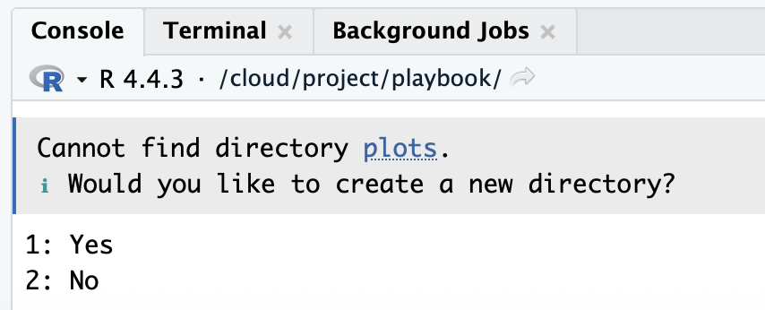
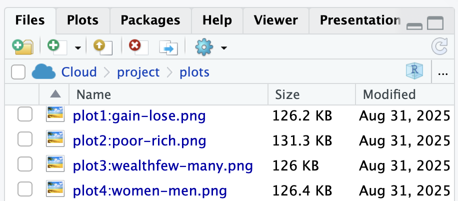

::: {.callout-note collapse="true"}
## Resources: `ggplot2`


:::

::: callout-warning
## Caution: Be patient, this page is slow to load

The gray code boxes with a **Run Code** button run R inside your web browser, so you do not need to install anything yet. The first time you open this page, your browser has to download R. **That can take 30 to 60 seconds**, and longer on campus Wi-Fi. Wait until the status at the top of the page says **Ready** before you click Run Code. If a box never becomes ready, keep reading: every step also shows the code and the plot it makes.
:::

## Start Here: What Does Code Do?

Code is a set of written instructions. You write a line, R follows it, and you see the result. In this chapter you do not need to understand every word of the code, and you do not need to write any code yourself. Your only job is to notice two things:

1.  **Code builds.** Each new line adds something to the plot.
2.  **Small changes matter.** Change one word or one number, run it again, and the plot changes.

::: callout-tip
## Go: Read the step, look at the plot, then try it

Each step below shows the code and the plot it makes. Under it is a **Try it** box where you can run the same code yourself and change one thing. You cannot break anything. If you get an error, reload the page and start again.
:::

```{webr-r}
#| context: setup
download.file("https://raw.githubusercontent.com/shanemccarty/FRIplaybook/main/data/insurance.csv", "insurance.csv")
insurance <- read.csv("insurance.csv")
library(ggplot2)
```

## Example Data: `insurance` {#example-data-insurance}

The example dataset is from the "Medical Cost Personal Costs" database on Kaggle. For this chapter, we refer to it as `insurance`.

### What do I do in this chapter?

You will read a little code, run it, and see what it makes. Before the first line of code, you need two words: **object** and **function**. Almost every line of R code uses both.

**An object is a thing with a name.** In R, anything you give a name to is called an **object**. Think of an object as a labeled box: R puts something inside the box, and from then on you use the name on the label to get it back. In this chapter the box is named `insurance`, and inside it is all of our data: a table with one row for each person and one column for each thing we know about them. A table of data like this is called a **dataset**. Every time you see the word `insurance` in the code below, it means "use that dataset".

**A function is an action.** A **function** is a command that does one job. You can spot a function because its name is followed by parentheses, like `head()`. Whatever you put inside the parentheses is what the function works on, called the function's **input**. If objects are the nouns of R, functions are the verbs. To see how many verbs R has, skim the [R Cheat Sheet: 200 Essential Functions](https://r-statistics.co/R-Cheat-Sheet.html). Each function comes with a one-line description and a short example you can run in your browser. You do not need to learn them now.

**`head()` shows the top of a dataset.** The first function in this chapter is `head()`. It shows the first six rows of a dataset, so you can check what is inside without printing all 1,338 rows. `head(insurance)` means "show me the first six rows of `insurance`": the function is `head()`, and the object it works on is `insurance`.

Now look at the two kinds of gray boxes you will see in this chapter.

A box with a small **clipboard icon** in its corner shows code and the result it made when this page was built. The clipboard copies the code so that you can paste it somewhere else, such as your own report. **You will not use the clipboard the first time you read this chapter, for Lab 1.** For now, you are looking at the code to learn what it does. Later, when you write your RD Report and Final Report, you will come back, click the clipboard, and paste the code into your own file. Here is an example:

```{r}
#| label: example-static-setup
#| include: false
insurance <- read.csv("data/insurance.csv")   # hidden: lets the example below show the same code as the live box
```

```{r}
#| label: example-static-head
head(insurance)
```

A box with a **Run Code** button is live. When you click the button, R runs that code inside your browser and shows you the result underneath. Try it now. Wait until the status at the top of the page says **Ready**, then click **Run Code**. You should see the same first six people in the dataset.

```{webr-r}
head(insurance)
```

That is all you do in this chapter: read the code, click **Run Code**, and watch what the code makes.

### Load and Import

These two lines *import* the data and *load* the `ggplot2` package. Think of **R** as a new **phone** and a ***package*** as an ***app***. A new **phone** can do a few things by itself, and ***apps*** add everything else. In the same way, **R** can do basic math and statistics, and `ggplot2` is the ***app*** that adds ***plots***. You install an ***app*** once, and you open it every time you want to use it. `library(ggplot2)` is how you open the ***app***.

```{r}
#| label: import-data-insurance
insurance <- read.csv("data/insurance.csv")
```

```{r}
#| label: load-library-ggplot2
library(ggplot2)
```

### Look at the data

Each row is one participant. Each column is one variable, such as `age`, `smoker`, and `charges` (the participant's medical costs). This time `head()` has two inputs, separated by a comma: the dataset, and the number `10`, which tells `head()` to show ten rows instead of six.

```{r}
#| label: review-header
head(insurance, 10)
```

## How do I visualize data in R?

The `ggplot2` packages uses seven layers to produce plots/figures for your paper and team poster:

1.  **Data**: The dataset you're visualizing

2.  **Mapping**: Which variables go on which axes (aesthetics)

3.  **Geometries**: The type of plot (points, lines, bars, etc.)

4.  **Facets**: Subplots based on categorical variables

5.  **Statistics**: Statistical transformations of the data

6.  **Coordinates**: The coordinate system (usually Cartesian)

7.  **Theme**: Visual styling and appearance

[](images/ggplot2-layers.png){fig-alt="the image includes 7 colors for each of the 7 layers"}](https://ggplot2.tidyverse.org/articles/ggplot2.html)

## Color-Coded Learning Guide

In this chapter, headings are color-coded to match the `ggplot2` layers:

:::::::::: {style="display: flex; flex-direction: column; gap: 12px; max-width: 700px; margin: 20px 0;"}
::: {style="padding: 12px 15px; background-color: #E69F00; color: white; border-radius: 8px;"}
```         
📊 Data: The dataset
```
:::

::: {style="padding: 12px 15px; background-color: #56B4E9; color: white; border-radius: 8px;"}
```         
🗺️ Mapping: Which variables go where
```
:::

::: {style="padding: 12px 15px; background-color: #009E73; color: white; border-radius: 8px;"}
```         
📍 Geometries: Points, bars, lines
```
:::

::: {style="padding: 12px 15px; background-color: #F0E442; color: black; border-radius: 8px; text-shadow: 1px 1px 2px rgba(0,0,0,0.3);"}
```         
📏 Scales/Statistics: Axes, calculations
```
:::

::: {style="padding: 12px 15px; background-color: #0072B2; color: white; border-radius: 8px;"}
```         
🔲 Facets: Separate panels
```
:::

::: {style="padding: 12px 15px; background-color: #D55E00; color: white; border-radius: 8px;"}
```         
📐 Coordinates: Coordinate system
```
:::

::: {style="padding: 12px 15px; background-color: #CC79A7; color: white; border-radius: 8px;"}
```         
🎨 Theme: Visual appearance
```
:::
::::::::::

Watch for these colors as you build plots step-by-step! 🎨

In summary, researchers construct a plot using `ggplot2` components in the same way a chef constructs lasagna in layers, one steps at a time.


## Build One Plot, One Layer at a Time

In this section you build one plot, a **histogram**, one layer at a time.

**What is a histogram?** A histogram shows how the values of **one continuous variable** are spread out. A continuous variable is a number that can take many values along a scale, such as age, income, or medical charges. To draw a histogram, R does three things:

1. It splits the range of the variable into equal slices, called **bins** (for example, charges from \$0 to \$2,000, from \$2,000 to \$4,000, and so on).
2. It counts how many participants fall into each bin. That count is called the **frequency**.
3. It draws one bar per bin. The bar's position on the **x axis** shows the range of values, and the bar's height on the **y axis** shows the frequency.

So you only tell R which variable goes on the x axis. The y axis is always the frequency, and R counts it for you.

**How to read one.** Tall bars are values that many participants have. Short bars are values that few participants have. Look at the shape: where the tallest bars are (the most common values), how wide the bars spread (the range), and whether one side stretches out farther than the other (a *tail*). A histogram looks a lot like a bar chart, but a bar chart counts **categories** (such as smokers and non-smokers) and has gaps between its bars. A histogram counts **ranges of numbers**, so its bars touch.

You will use histograms again to describe your own data and to check whether a variable is normal (see [Describe Your Data](describe.qmd)). Watch how each line of code below adds one layer.

#### [Step 1: Set up data]{.data-layer}

```{r}
ggplot(data = insurance)
```

You get an empty gray box. R knows which data to use, but not what to draw.

**Try it.** Click Run Code. You should see the same empty box.

```{webr-r}
ggplot(data = insurance)
```

#### [Step 2: Set up mapping]{.mapping-layer}

A histogram needs only one variable, on the x axis.

```{r}
ggplot(data = insurance,
       mapping = aes(x = charges))
```

Now the x axis has numbers, because R knows that `charges` goes there. There is still nothing drawn.

**Try it.** Run the code. Then change `charges` to `age` and run it again. What changed on the x axis? `aes(x = ...)` tells R which variable goes on the x axis, so the numbers along the bottom change from dollar amounts (charges run from about 1,000 to 64,000) to years (age runs from 18 to 64). The label under the axis changes too. Everything else stays the same, because you have not changed the data or added anything to draw.

```{webr-r}
ggplot(data = insurance,
       mapping = aes(x = charges))
```

::: callout-warning
## Caution: Close every `(` with a `)`

Every opening parenthesis `(` needs a closing `)`. Look at the code above: `ggplot(` opens on the first line, `aes(` opens on the second, and the line ends with `))`, one `)` for each. If you leave a `(` hanging without its `)`, R waits for the rest of the command and shows a `+` in the Console instead of the `>` prompt. Nothing runs until you close it. When that happens, click in the Console, press Esc, add the missing `)`, and run the code again. Before you run a code block, count the `(` and the `)`: the numbers must match.
:::

#### [Step 3: Add geometry (bars)]{.layers-layer}

```{r}
ggplot(data = insurance,
       mapping = aes(x = charges)) +
  geom_histogram(bins = 30)
```

One more line, and the bars appear. The `+` at the end of a line means "and then add this". Notice that the code never mentions the y axis: `geom_histogram()` counts the participants in each bin and puts that frequency on the y axis for you.

**Read the plot.** The tallest bars are on the left: most participants have low charges (about 3 in 4 have charges under \$15,000). A few bars stretch far to the right, out past \$40,000. That long stretch on one side is called a **right tail**, and it means a small number of participants have very high charges. A histogram with a long tail on one side is called **skewed**.

**Try it.** Run the code. Then change `30` to `5`, and then to `100`. Same data, same plot type, a very different picture. `bins` is the number of bars: R splits the x axis into that many equal-width slices and counts how many people fall in each one. With `bins = 5`, each bar covers a wide range of charges, so the plot is smooth but hides detail. With `bins = 100`, each bar covers a narrow range, so you see every bump and gap, including some that are only noise. There is no single right number. Try a few and pick one that shows the shape without the noise.

```{webr-r}
ggplot(data = insurance,
       mapping = aes(x = charges)) +
  geom_histogram(bins = 30)
```

::: callout-warning
## Caution: Don't start a line with `+`

Layers are joined with a `+` at the **end** of a line. If a line **starts** with `+`, R runs the plot without that layer and then gives you an error. Look at the code above: the `+` comes at the end of the line, right before `geom_histogram()`.
:::

#### [Step 4: Add labels and a theme]{.theme-layer}

The plot works, but its axes still show the raw names `charges` and `count`. Now add a title and axis labels that a reader of your report will understand. The y axis label describes the frequency that R counted, so it always says what was counted, such as "Number of Participants". You do not need `y =` anywhere in the code; a histogram's y axis is always the frequency.

```{r}
#| label: plot-charges-histogram
#| fig-cap: "Figure 1. A histogram of insurance charges. Most people have low charges and a few people have very high charges."
#| fig-alt: "A histogram of insurance charges with a tall peak on the left and a long tail to the right."
#| fig-height: 5
#| fig-width: 7

plot_charges <- ggplot(data = insurance,
       mapping = aes(x = charges)) +
  geom_histogram(bins = 30, fill = "#005a43", color = "white") +
  ggtitle("Distribution of Insurance Charges") +
  xlab("Insurance Charges") +
  ylab("Number of People") +
  theme_bw()

plot_charges
```

**Try it.** Run the code. Then change `"#005a43"` to `"purple"`. `fill` is the color inside each bar, and `color` is the color of the bar's outline, which is why the bars have thin white edges. `"#005a43"` is a hex code for Binghamton green; `"purple"` is one of the color names R already knows. Next, change the text inside `xlab("...")` and run again: `xlab()` and `ylab()` set the axis labels, and `ggtitle()` sets the title above the plot. Finally, change `theme_bw()` to `theme_minimal()`: a theme controls everything that is not data, such as the background color and gridlines. Then delete the `+` at the end of one line and run it. You will get an error. That is normal: put the `+` back and run it again.

```{webr-r}
ggplot(data = insurance,
       mapping = aes(x = charges)) +
  geom_histogram(bins = 30, fill = "#005a43", color = "white") +
  ggtitle("Distribution of Insurance Charges") +
  xlab("Insurance Charges") +
  ylab("Number of People") +
  theme_bw()
```

::: callout-warning
## Caution: Saving a plot does not show it

`plot_charges <- ggplot(...)` saves the plot as an object in your environment. To see it, type the object's name on its own line (or use `print()`), like the last line of the code above.
:::

#### Step 5: Find the foul

When code does not work, most people's first move is to change everything: rewrite the plot, copy new code from somewhere else, or start over. Don't. The problem is usually **one small character**: a missing `)`, a missing `"`, a missing comma or `+`, or a capital letter where there should not be one. Look for the small mistake first. Big changes can add new problems on top of the one you had.

::: callout-tip
## Go: Look small before you change anything

1. **Read the error message.** It names a line or a word. Start there, and then look at the line just above it, because the mistake is often one line earlier than R says.
2. **Count the `(` and the `)`.** The numbers must match.
3. **Check every `"`.** Text such as `"Insurance Charges"` needs a quote at both ends.
4. **Check the end of each line.** Every layer except the last one ends with `+`.
5. **Check the spelling and the capital letters.** `Charges` is not `charges`.
6. **Fix one thing and run the code again.** R reports only the first problem it finds, so a new error after a fix often means you are getting closer.
:::

**Try it.** The code below is the plot from Step 4 with two small mistakes in it. Run it and read the error. Then find and fix both mistakes without rewriting anything else. You are done when the green histogram appears. (If the Run Code box never loads, you can still find both mistakes by reading.)

```{webr-r}
ggplot(data = insurance,
       mapping = aes(x = charges) +
  geom_histogram(bins = 30, fill = "#005a43", color = "white") +
  ggtitle("Distribution of Insurance Charges") +
  xlab("Insurance Charges) +
  ylab("Number of People") +
  theme_bw()
```

::: {.callout-note .gray collapse="true"}
## Answer: the two fouls

**Foul 1: a missing `"` on line 5.** `xlab("Insurance Charges) +` opens the text with `"` but never closes it, so R reads everything up to the next `"` as one long label. The error points at line 6 (something like *unexpected symbol*), but the mistake is on line 5. The fix: `xlab("Insurance Charges") +`.

**Foul 2: a missing `)` on line 2.** `aes(x = charges)` closes `aes(`, but nothing closes `ggplot(`. After you fix Foul 1, R reaches the end of the code still waiting for that `)` and says something like *unexpected end of input*. The fix: `mapping = aes(x = charges)) +`, with two `)`, just like Step 4.

The fixed code:

```r
ggplot(data = insurance,
       mapping = aes(x = charges)) +
  geom_histogram(bins = 30, fill = "#005a43", color = "white") +
  ggtitle("Distribution of Insurance Charges") +
  xlab("Insurance Charges") +
  ylab("Number of People") +
  theme_bw()
```

Two characters fixed, nothing rewritten. That is how most broken code gets fixed.
:::

## What You Just Learned About Code

- **Code runs from top to bottom**, one line at a time.
- **Each line adds one thing.** You built a plot in four steps: data, mapping, bars, then labels and a theme.
- **Small changes give different results.** One number changed the whole shape of the histogram.
- **Errors are normal, and they can be fixed.** A missing `+` broke the plot, and putting it back fixed it.

That is how all of the code in this playbook works, not only plots.

## How Most Chapters Work

You just watched a play and tried it in your browser. From here on, most chapters that use data give you three passes:

1.  **The Play.** You watch: the chapter walks through the code with an example dataset, as this chapter did.
2.  **The Lab.** You practice in RStudio with the lab dataset that everyone shares. Labs are not graded. Ref the Raccoon, the referee of this playbook, shows you the answer you should get, so you can check your own work.
3.  **Your Turn.** You run the play with your own team's data. There is no Ref, but there is a checklist.

To do The Lab and Your Turn, you need R and RStudio on your own computer. That is the next chapter: [R Software](RStudio.qmd).

## Come Back Later: Themes, Colors, and Saving a Plot

Skip the rest of this chapter on your first read. Come back when you are making plots for your *RD Report*.

### Pick One Theme

`theme_bw()` controls the overall look of the plot. There are several [complete themes](https://ggplot2.tidyverse.org/reference/ggtheme.html) to choose from.

::: {.callout-important .required}
## Required for Team Poster: pick one theme for your team

Team members should pick **one theme** (from the [complete themes](https://ggplot2.tidyverse.org/reference/ggtheme.html)) to use with all plots in your individual reports and the team poster!
:::

::: {.callout-note collapse="true"}
## Resources: colors in `ggplot2`

- [4 ways to use colors in ggplot2 more efficiently](https://albert-rapp.de/posts/ggplot2-tips/07_four_ways_colors_more_efficiently/07_four_ways_colors_more_efficiently.html)
- [Dealing with colors in ggplot2](https://r-graph-gallery.com/ggplot2-color.html)
- [Customizing ggplot2 color and fill scales](https://sjspielman.github.io/introverse/articles/color_fill_scales.html)
- [How to use better colors in ggplot (youtube)](https://www.youtube.com/watch?v=ZVSbY4z7tMY)
:::

### Save Your Plot with `ggsave()` {#save}

[ggsave( )](https://ggplot2.tidyverse.org/reference/ggsave.html) is a specific function to save a plot as an image in .jpg or .png image. The plot is saved as a file inside your RStudio Project folder, so you can add it to your team poster.

```{r}
# Print and save to the plots folder
print(plot_charges)
ggsave("plots/plot1_charges_histogram.png", 
       plot = plot_charges,
       width = 10, height = 8, dpi = 300)
```

::: {.callout-important .required}
## Required: `ggsave( )`

Your *RD Report* and *Final Report* must include `ggsave( )` for plots, because you will want to easily export these plots and then add them onto your team poster. **You do not need to do this now.** You will do it later, with the plots you make from your team's real dataset. Here is how it will work:

The use of `plots/` in the `ggsave()` code chunk saves the image into a folder called **plots** inside your project. If you do not have a **plots** folder yet, the console will ask you whether to create it: type "1" and click return/enter.

In your **files tab**, click the **plots** folder to see your saved images.

Then, upload the plot (and your other plots) to your team's google drive \> Team Survey Data \> Quant Data \> Plots. The image file is in the **plots** folder inside your `Lastname_FRI` project folder on your computer.

{fig-alt="a screenshot of the console output after running the ggsave code"}

{fig-alt="a screenshot of the files tab showing the saved image files inside the plots folder"}
:::

::: callout-warning
## Caution: Don't use spaces, colons, or slashes in file names

Use letters, numbers, underscores (`_`), and hyphens (`-`) only: `plot1_charges_histogram.png` or `plot1-charges-histogram.png`. Do not use spaces, colons, or slashes in a file name. Some computers cannot save or open those files.
:::
