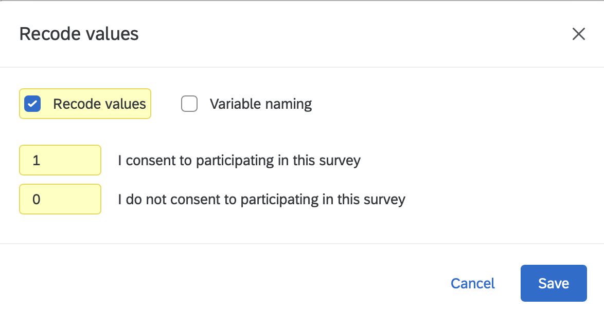
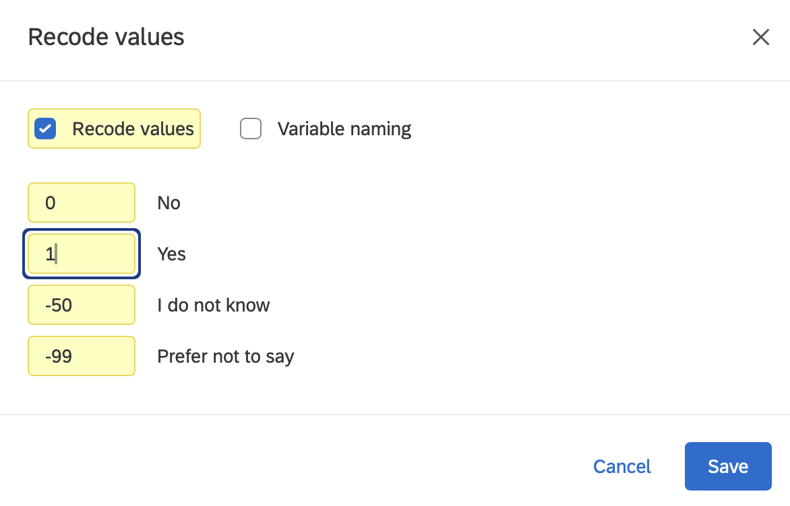
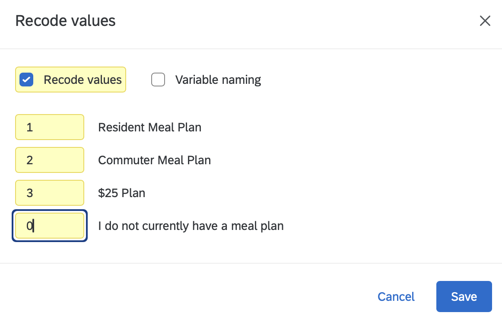
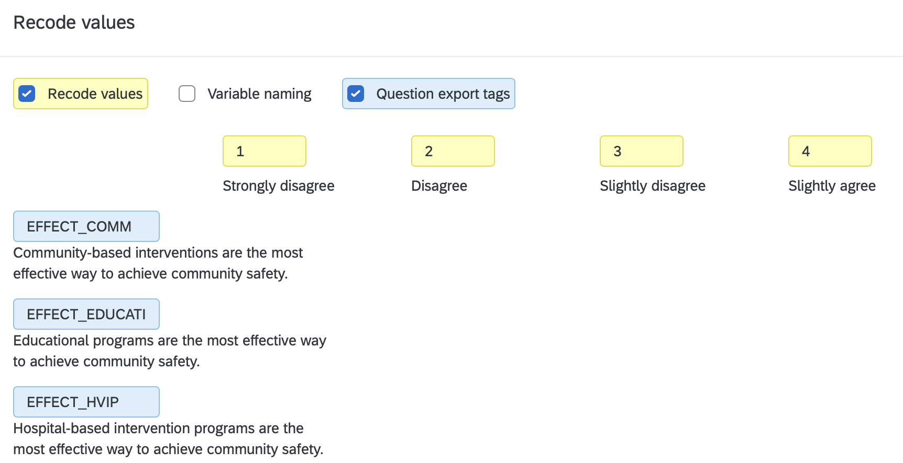
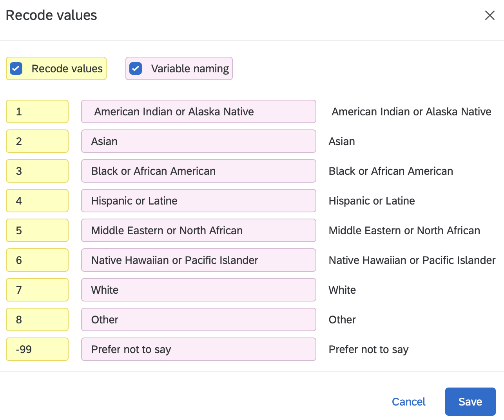
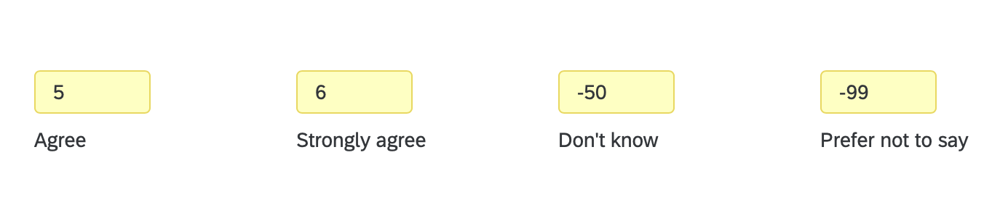
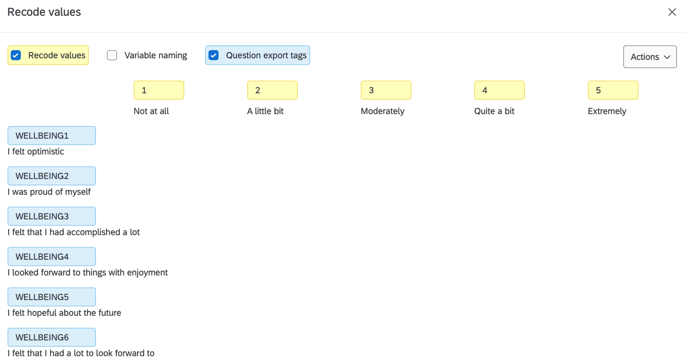
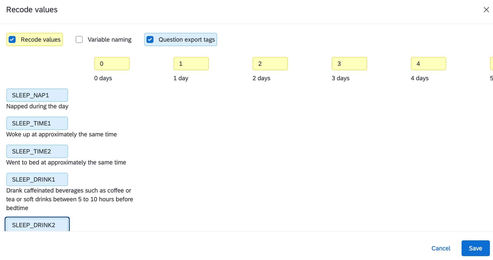
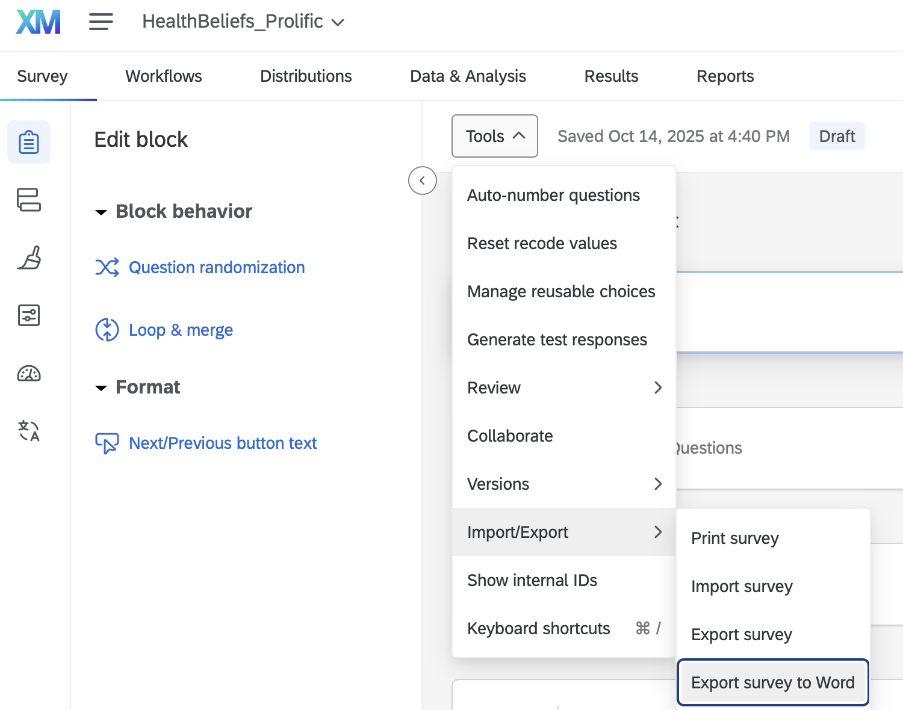
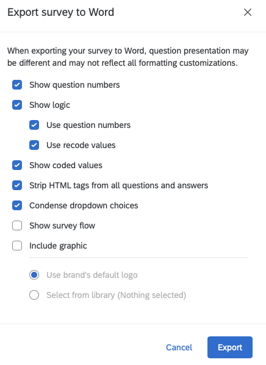

::: {.callout-note collapse="true"}
## Resources: Qualtrics

- [Recode Values](https://www.qualtrics.com/support/survey-platform/survey-module/question-options/recode-values/) in the Qualtrics support guide
- [Question export tags](https://www.qualtrics.com/support/survey-platform/survey-module/question-options/recode-values/#VariableNaming) (variable naming) in the same guide
- [Export a survey to Word](https://www.qualtrics.com/support/survey-platform/survey-module/survey-tools/import-and-export-surveys/#ExportingASurveyToWord)
:::

::: {.callout-important .required}
## Required: do this before anyone exports the data

When data collection ends, your team will **export** the survey from Qualtrics and then **import** it into R (quantitative track) **or** NVivo (qualitative track). Each team member will make a copy of the shared team dataset for their individual reports. Then, your teammates will move forward with coding for your individual questions. If you identify a mistake in your exported team data after you have exported the team dataset, the team cannot merge the dataset in R with the dataset in NVivo to analyze results for any mixed-methods research questions. There is no fixing this afterwards. The best way to avoid this problem is to follow the steps in the green box below that overviews the upcoming chapter.
:::

::: callout-tip
## Go: Meet as a team to follow these steps

Your team should use your team meeting or team time during lecture to **follow these steps together** before anyone exports or downloads your Qualtrics survey data.

**Name** every variable in your Qualtrics survey → **Recode** every answer choice so there are numerical values assigned to **all** of the response options → **Check** with the team codebook → **Publish** your Qualtrics survey again → **Export** your survey questions to Word with the coded values showing (the last section of this chapter).

**When:** team time in the **October 2 lecture**. By the end of that lecture, your team's Google Drive should have the two files described at the end of this chapter.
:::

::: callout-warning
## Caution: what is safe to change after data collection has started

**Safe:** renaming a variable (the export tag) and recoding values. Qualtrics applies both to every response already collected, at export time.

**Not safe:** adding, deleting, or rewording answer choices, or moving questions between blocks. Those change what respondents saw, so responses before and after the change are not comparable. If you must, write down the date and tell your peer mentor and/or Dr. Shane.
:::

## Why Variable Names Matter

In [Coding a Plot](layers.qmd), the first thing you did with the `insurancedata` dataset was look at its variable names and its first rows:

```{r}
#| label: why-names-insurancedata
#| message: false
insurancedata <- read.csv("data/insurance.csv")
names(insurancedata)
```

```{r}
#| label: why-names-head
#| echo: false
knitr::kable(head(insurancedata, 4), caption = "The first four rows of `insurancedata`: one column per variable, one row per person.")
```

You could read that table without a codebook. `age` is an age, `smoker` says whether the person smokes, `charges` is what their insurance cost. Each name is short enough to type in a line of code and long enough to say what the column holds. That is the goal for your team's survey: when you type `names(alldata)` in October, every name should tell you what the variable is **without** spelling out the whole question.

Here is the same table the way Qualtrics exports a survey when nobody has named the questions:

```{r}
#| label: why-names-qualtrics-default
#| echo: false
unnamed <- head(insurancedata, 4)
names(unnamed) <- paste0("Q", 1:ncol(unnamed))
knitr::kable(unnamed, caption = "The same four rows with Qualtrics' default names. Which column is the smoker question? You would have to open the survey to find out, every time.")
```

Now `Q5` is the smoker question and `Q7` is the cost, and you will forget which is which by next week. Every line of code you write, every plot label, and every table in your report will carry these names, and so will the NVivo project your qualitative teammates build from the same export. A name typed once in Qualtrics, before the export, saves the whole team from decoding `Q17` for the rest of the semester. The rest of this chapter is how to do it.

## Log in to Qualtrics

- [ ] Log into Qualtrics: <https://binghamton.co1.qualtrics.com>
  - [ ] Under Active surveys, click on your survey. You are now in the **Survey** tab (the survey builder), which is where everything in this chapter happens.
- [ ] Work through the survey one question at a time, in this order: first **name** every variable (see 7.3), then **name the blocks** (see 7.4), then **recode** the values (see 7.5). The rules for each are below.
- [ ] When you are done with all three, click **Publish**. Until you publish, the live survey still has the old names and values.

## Name Your Variables in Qualtrics

In Qualtrics, the variable name is the **question export tag**: the name that becomes the column header when you export the data, and the name R and NVivo will use. Every question shows its current name in small text at its top left, and Qualtrics starts them all as `Q1`, `Q2`, `Q3`, … Naming a variable means replacing that. The rules for the names come first (7.3.1); where you type them depends on the kind of question (7.3.2 to 7.3.4).



### The rules for names

| Rule | Do this | Not this |
|----|----|----|
| ALL CAPS | `EFFICACY` | `selfefficacy` |
| No spaces or symbols (letters, numbers, and `_` only) | `SELFEFFICACY` | `SELF EFFICACY`, `self-efficacy` |
| Short: 14 characters or fewer. Qualtrics cuts long tags off, and R code is easier to read | `EFFICACY` | `EFFECT_EDUCATI` (this is what a cut-off tag looks like) |
| One measure, several items: NAME plus the item number, no underscore | `WELLBEING1` … `WELLBEING8` | `WELLBEING_1`, `WB1`, `Wellbeing item 1` |
| One measure with subscales: BIG_SMALL plus the item number | `STIGMA_PUB1`, `STIGMA_SELF1` | `PUBSTIG1`, `SS1` |
| Reverse item: add `_R` at the end (see below) | `STIGMA_PUB4_R` | `STIGMA_PUB4rev`, `STIGMA_PUB4 (reversed)` |
| Same measure at two times: `_PRE` and `_POST` (or `_T1` and `_T2`) | `EFFICACY1_PRE`, `EFFICACY1_POST` | `EFFICACY1`, `EFFICACY1b` |
| Binary (yes/no) variable: add `_01`, code it **No = 0, Yes = 1**, and name it for the answer that gets the 1. No `CAT`: `CAT` is only for categories you create later in R | `TREATED_01` (0 = has not received mental health treatment, 1 = has); `KNOWS_01` (0 = does not know anyone with a mental health problem, 1 = does) | `TREATMENT`, `MHTX`, `TREATED_01`, `TREATED` coded yes = 1, no = 0 |
| A categorical variable you will **create later in R** by transforming a variable that is already in the survey (cutting a score into bands, or collapsing a question's response options into fewer categories): `_#CAT`, where \# is the number of categories the new variable has, and `_01CAT` when it is a 0/1 split you made. `CAT` is the mark of a variable **you** made in R from an existing one, so nothing in Qualtrics ever gets it ([Transforming Your Data](dplyr.qmd)) | `DISTRESS_4CAT` (the ten K10 items summed, then cut into 4 bands), `EDUCATION_3CAT` (7 education options collapsed into 3), `RACIALIZED_6CAT` (the select-all boxes combined into 6 categories) | `DISTRESSCATS`, `EDU3` |
| Open-ended (text) question, the answers your qualitative teammates will code in NVivo: add `_QUAL` (see the box below) | `BARRIERS_QUAL`, `SENTENCE1_QUAL` | `BARRIERS`, `BARRIERS_TEXT`, `Q14` |
| A block is not a variable: the container of a matrix (and a page-level block) gets the measure's name plus `BLOCK` (see 7.4) | block `STIGMABLOCK`, variables `STIGMA_PUB1` … | block and variable both called `STIGMA` |

::: callout-important
## Important: open-ended questions end in `_QUAL`

Any question where the respondent **types an answer in their own words** is a qualitative variable: it will be exported with everything else, but it is coded in **NVivo** by the qualitative track, not analyzed in R. Name it `VARIABLE_QUAL`: `BARRIERS_QUAL` for "What would make it hard for you to get help?", `SENTENCE1_QUAL` for "Why did you choose this sentence length?" after the first vignette.

The ending does three jobs. In the export, every `_QUAL` column is easy to spot, so the quantitative track knows to leave those columns alone and the qualitative track knows exactly which columns to import as open-ended (NVivo asks you to mark each column as open or closed at import, and getting it wrong means importing again). In the team codebook, `_QUAL` marks the rows whose values are text, not numbers. And when a quantitative question and its open-ended follow-up belong together (`SENTENCE1` and `SENTENCE1_QUAL`), the shared stem keeps them side by side for the mixed-methods work later.

Two things that are **not** `_QUAL`: a number typed into a box (`AGE`) is a number, and the "Other (please specify)" box attached to a closed question exports automatically as `VARIABLE_#_TEXT` (for example `RACIALIZED_8_TEXT`); leave that name alone and treat the column like a `_QUAL` variable.
:::

### Single Question

A single question gives one answer per person: `CONSENT`, `AGE`, `HEALTHSTATUS`, a yes/no question. In the survey builder, click the question's name (the `Q12` at its top left), type the new name, and press Enter. That is the whole job. You do not need the Recode values dialog for this; its **Variable naming** checkbox renames the answer choices, not the question.

{fig-alt="The Qualtrics survey builder with a consent question selected. Its name box at the top left reads CONSENT with the cursor still in it. Below it is the Statement of Consent text and two answer choices: one consenting and confirming eligibility, one declining."}

{fig-alt="A Qualtrics question named AGE at its top left, asking What is your age? (enter a whole number, such as 45), with a text entry box." width="75%"}

{fig-alt="A Qualtrics question named HEALTHSTATUS asking Would you say your health in general is excellent, very good, good, fair, or poor, with choices Poor, Fair, Good, Very Good, Excellent, Don't know, and Prefer not to say." width="75%"}

::: callout-warning
## Caution: name the question, not the text above it

A survey often shows a block of text (the consent form, an instruction, a vignette) as a separate item right before the question people answer. That text item has its own `Q#`, and it exports nothing. Put `CONSENT` on the question with the answer choices, as in the screenshot, and leave the consent-form text item alone. The same goes for any instruction text that sits above a matrix.
:::

### Matrix Statements

A matrix question has one instruction and several statements in rows, all answered on the same scale: the stigma items, the K10, a well-being scale. Qualtrics exports **one column per row**, so it is the rows that need names, and the question name and the row names are set in two different places.

1.  Click the question's name at its top left and rename it for the measure plus `BLOCK` (`STIGMABLOCK`, `AVOIDBLOCK`; see 7.4). This name is for you; it is not a column in the data.
2.  Click the question, open **Recode values** in the left panel, and check **Variable naming**. A name box appears next to every statement.
3.  Type a name for each row, following the multi-item rule: `NAME1`, `NAME2`, … for one construct, or `BIG_SMALL1`, `BIG_SMALL2`, … when the rows belong to subscales. Add `_R` to a reverse item. Those row names are what R sees.

{fig-alt="The Variable naming panel of a Qualtrics matrix question. Each statement has a name box above it: AVOID_SLEEP6, AVOID_SLEEP7, AVOID_SLEEP8, AVOID_MDD1, AVOID_MDD2, and AVOID_MDD3, which is selected with the cursor in it." width="60%"}

<!-- SHANE: screenshot to add: the STIGMA matrix with Variable naming checked, showing STIGMA_PUB1 to STIGMA_SELF4_R. Suggested file: images/qualtrics-matrix-stigma.png -->

### Select-All Question

A select-all question (checkboxes, such as the select-all version of `RACIALIZED`) exports one column per box. Rename the question in the builder (`RACIALIZED`) and stop there: Qualtrics adds `_1`, `_2`, … to the question name for each box, so you do not name the boxes yourself. The values that go into those columns are set in 7.5.

### A measure with subscales: the lab example

The lab dataset measures **stigma** with two subscales, **public stigma** (what a person thinks most people believe) and **self stigma** (how a person would feel about their own mental health problem). Both are in one Qualtrics matrix. Naming them BIG_SMALL# does two jobs at once: in R, you can score the total (`STIGMA`, all eight items) and each subscale (`STIGMA_PUB`, `STIGMA_SELF`) from the same names, and anyone reading your code can see which items belong together.

| Export tag | Item | Subscale |
|----|----|----|
| `STIGMA_PUB1` | Most people would think less of a person who has received treatment for a mental health problem. | public |
| `STIGMA_PUB2` | People with mental health problems are partly to blame for their situation. | public |
| `STIGMA_PUB3` | Most employers would pass over the application of someone with a history of mental illness. | public |
| `STIGMA_PUB4_R` | Most people would accept a person with a mental illness as a close friend. | public, **reverse** |
| `STIGMA_SELF1_R` | I would be comfortable telling friends that I was seeing a therapist. | self, **reverse** |
| `STIGMA_SELF2` | I would feel ashamed if I needed treatment for a mental health problem. | self |
| `STIGMA_SELF3` | Seeking help for a mental health problem would make me feel like I could not handle my own problems. | self |
| `STIGMA_SELF4_R` | If I had a mental health problem, I would feel fine telling my family about it. | self, **reverse** |

All eight items use the same answer choices: Strongly disagree (1), Disagree (2), Neither (3), Agree (4), Strongly agree (5). Higher = more stigma.

### Reverse items: name them here, reverse them in R

::: callout-important
## Important: do not reverse the values in Qualtrics

A **reverse item** is worded in the opposite direction from the rest of its scale. Agreeing with "Most people would accept a person with a mental illness as a close friend" means *less* stigma, while agreeing with every other item means *more*.

**In Qualtrics:** add `_R` to the export tag, and recode the values exactly as for the other items (Strongly disagree = 1 … Strongly agree = 5), in the same direction.

**In R:** reverse the `_R` items with `6 - x` (for a 1-to-5 scale) before you average. [Creating Composites](composite.qmd) shows this with `scoreItems()`, where a minus sign in front of the item name does the reversing.

**Why not in Qualtrics?** If you reverse the values in Qualtrics *and* the code in R reverses the `_R` items, the item gets reversed twice and ends up backwards, and nothing warns you. Recoding the values (7.5) is fine and expected; reversing them is the part that belongs in R. Keeping the raw export in one direction means the reversal is visible in your code, where a reader (and a grader) can check it.
:::

### A single scale with many items: the K10

The **Kessler Psychological Distress Scale (K10)** in the lab dataset has ten items, one construct, and no subscales, so the export tags are simply `DISTRESS1` to `DISTRESS10`, and all ten share one set of answer choices: None of the time (1), A little of the time (2), Some of the time (3), Most of the time (4), All of the time (5). That is all the naming a single scale needs.

| Export tag   | In the past 4 weeks, about how often did you feel … |
|--------------|-----------------------------------------------------|
| `DISTRESS1`  | tired out for no good reason?                       |
| `DISTRESS2`  | nervous?                                            |
| `DISTRESS3`  | so nervous that nothing could calm you down?        |
| `DISTRESS4`  | hopeless?                                           |
| `DISTRESS5`  | restless or fidgety?                                |
| `DISTRESS6`  | so restless you could not sit still?                |
| `DISTRESS7`  | depressed?                                          |
| `DISTRESS8`  | that everything is an effort?                       |
| `DISTRESS9`  | so sad that nothing could cheer you up?             |
| `DISTRESS10` | worthless?                                          |

What happens to the ten items afterwards belongs to later chapters: [Transforming Your Data](dplyr.qmd) cuts the K10 total into its published bands (`DISTRESS_4CAT`, `DISTRESS_01`), and [Creating Composites](composite.qmd) scores the scale.

### Shared class variables

Every team's survey has these variables, with exactly these names and values, so that the class can be analyzed together. `ResponseId` is created by Qualtrics and is the only name that is not all caps.

| Variable | Question | Values |
|----|----|----|
| `ResponseId` | (automatic) | Qualtrics' ID for each response. Never rename or delete it. |
| `PASSWORD` | The code the respondent made up (pre/post teams only) | Text. It links a person's pretest row to their posttest row, so it must be in the survey exactly once with exactly this name. |
| `TIME` | Is this your first (pretest) or second (posttest) time taking this survey? (pre/post teams only) | 0 = pretest; 1 = posttest. A shared variable, so it keeps this name (like `CONSENT`) instead of ending in `_01`; the 0/1 coding makes it ready for a model later ([Pre/Post Data](prepost.qmd)). |
| `CONSENT` | Consent statement | 0 = does not consent (or is not eligible); 1 = consents and is eligible |
| `AGE` | What is your age? | Whole number. Turn on Qualtrics **content validation** (number, 18 to 99) so nobody can type "twenty". |
| `GENDER` | Which term best describes your current gender identity? | 0 = Girl or woman; 1 = Boy or man; 2 = Nonbinary, genderfluid, or genderqueer; 3 = Not sure or questioning; -50 = Don't know what this means; -99 = Decline |
| `RACIALIZED` (single choice) **or** `RACIALIZED_1` … `RACIALIZED_8`, `RACIALIZED_99` (select all) | What is your racial/ethnic identity? Some teams asked it as **single choice**, others as **select all that apply**. Name the question `RACIALIZED` either way; for select-all, Qualtrics adds `_1` … `_99` for the boxes | 1 = American Indian or Alaska Native; 2 = Asian; 3 = Black or African American; 4 = Hispanic or Latine; 5 = Middle Eastern or North African; 6 = Native Hawaiian or Pacific Islander; 7 = White; 8 = Other (write-in, exported as `RACIALIZED_8_TEXT`); -99 = Prefer not to say |
| `SOCIALSTATUS` | The ladder | 1 (bottom) to 10 (top) |
| `HEALTHSTATUS` | Would you say your health in general is … | 1 = Poor; 2 = Fair; 3 = Good; 4 = Very good; 5 = Excellent |
| `IDAS_WELL` | I felt hopeful about the future | 1 = Not at all; 2 = A little bit; 3 = Moderately; 4 = Quite a bit; 5 = Extremely |
| `IDAS_ANX` | I found myself worrying all the time | 1 to 5, as above |

::: callout-important
## Important: the variable is named RACIALIZED, in both versions of the question

**Why `RACIALIZED` and not `RACE`.** The survey question asks people how they identify, and the answer is real. But a variable called `RACE` quietly claims that race is a trait inside the person, and later, when it becomes a predictor, students read the result as an effect of "being Black." Three books this course draws on say the same thing from different directions: race is produced by racism, the practice of sorting people and treating them accordingly (Fields & Fields, *Racecraft*); treating race as a cause in a statistical model hides the racialized conditions that do the causing (Zuberi & Bonilla-Silva, *White Logic, White Methods*); and categories in a dataset are made by someone, for a purpose, and the data should say so (D'Ignazio & Klein, *Data Feminism*). So the variable is named for the **process**: `RACIALIZED`. The question wording stays as respondents see it. See [Data Equity](data-equity.qmd).

**Two versions of the question exist in this class.** Do not switch from one to the other now: that would change what respondents see (see the Caution at the top of this chapter). Find out which one your survey has, and recode it accordingly:

- **Single choice** (one answer). One variable, `RACIALIZED`, with the values in the table above and `-99` for *Prefer not to say*. The screenshot below shows this dialog.
- **Select all that apply** (checkboxes). Qualtrics exports **one column per box** (`RACIALIZED_1`, `RACIALIZED_2`, … `RACIALIZED_8`, `RACIALIZED_99`, each filled in when that box was checked) when you export with *Split multi-value fields into columns* checked ([Export Survey Data](export.qmd)). Give each box the value in the table above, so that `RACIALIZED_7` holds a 7 when White is checked.

In R, [Transforming Your Data](dplyr.qmd) shows how to turn either version into `RACIALIZED_6CAT` or `RACIALIZED_5CAT` (White, Asian, Black, Hispanic or Latine, Another identity, and, for select-all only, **Two or more**) and `RACIALIZED_01` (0 = racialized as white, 1 = racialized as a person of color).

If the question has an "Other" text box, leave it: it exports as `RACIALIZED_8_TEXT` in both versions, and you will treat it as a `_QUAL` variable (see the `_QUAL` box in 7.3).
:::

## Name Your Survey Blocks

A matrix question is a container: its own name sits at the top left, and the variables are the rows inside it (7.3.3). That container is what we call the **block**. It is not exported as a column, but its name shows up in the survey builder, the survey flow, and your Word export, and a container called `AVOID` holding rows called `AVOID_SLEEP1` … confuses everyone, including you in three weeks. So give the container a name that says it is a block: click its name at the top left and add `BLOCK` to the measure's name, `AVOIDBLOCK`, `STIGMABLOCK`. The same goes for the page-level blocks that group questions in the survey builder (`CONSENTBLOCK`, `DEMOGRAPHICSBLOCK`).

{fig-alt="A Qualtrics matrix question whose name at the top left is AVOIDBLOCK. Below the instruction, two statements about not wanting to know one's risk for poor sleep are answered on a seven-column scale from Strongly Disagree to Strongly Agree plus Prefer not to say."}

## Recode the Values

Recoding assigns a number to each answer choice. Click the question, open **Recode values** in the left panel, and check the **Recode values** box. A number box appears next to every answer choice; type the values below. Qualtrics exports the numbers; the words are only for the respondent.

| Kind of question | Values | Example |
|----|----|----|
| Consent | 0 = does not consent, 1 = consents | `CONSENT` (a shared class variable, so it keeps its name) |
| Pretest or posttest | 0 = pretest, 1 = posttest | `TIME` (pre/post teams; a shared class variable, so it keeps its name) |
| Yes/no, have/do not have | **0 = No, 1 = Yes** (the Yes is the thing the variable is named for) | `TREATED_01`: 0 = has not received treatment, 1 = has |
| "None", "never", "I do not have one", "no benefits": a **true zero** | 0, and then 1, 2, 3 … for the real answers (see the example below) | `MEALPLAN`: 0 = no meal plan, then 1, 2, 3 for the plans |
| Agreement, frequency, or other ordered scale | 1 for the lowest step up to the highest step, in order | Strongly disagree (1) … Strongly agree (5) |
| Categories with no order (majors, states, plans) | 1, 2, 3 … in the order shown; the numbers are labels only | `STATE` |
| Prefer not to say / Decline | **-99** | every question that offers it |
| Don't know / Not sure | **-50** | every question that offers it |

In R, `-99` and `-50` both become missing (`NA`) in the first cleaning step ([Import Data Once](import-once.qmd)), so they never get averaged into a score by mistake.

::: callout-tip
## Go: when an answer means "none", code it 0

Some answer choices mean the *absence* of the thing the question asks about. Give that choice a **0**, and number the real answers from 1. Here is a select-all question about reducing social media use:

| Answer choice | Code |
|----|----|
| Better concentration and focus | 1 |
| Improved sleep | 2 |
| More free time | 3 |
| Increased motivation for hobbies or personal goals | 4 |
| Increased social interaction | 5 |
| Increased productivity | 6 |
| Less stress or anxiety | 7 |
| Less social comparison | 8 |
| Other (please specify) | 9, with the write-in exported as `BENEFITS_9_TEXT` |
| I did not perceive any benefits. | **0** |

Codes 1 to 8 are all different kinds of benefit; "no benefits" is logically zero of them, so 0 is the number that means what the answer means. The payoff comes in R: because every real benefit is 1 or higher and "none" is 0, one line makes a binary variable, `BENEFITS_01` (0 = no benefits, 1 = at least one), and the percent who reported any benefit is its mean ([Transforming Your Data](dplyr.qmd)). If "none" had been coded 9, it would sit among the benefits and you would have to remember to pull it out every time.

Note the difference from the missing codes: "no benefits" is a real answer, so it gets 0. "Prefer not to say" (-99) and "Don't know" (-50) are not answers, and they become `NA` in R.
:::

::: callout-important
## Important: every binary variable is No = 0, Yes = 1

Qualtrics numbers a yes/no question the way the choices were typed, usually **Yes = 1, No = 2**. Change it, every time, to **No = 0 and Yes = 1**, with the 1 on the answer the variable is named for (`TREATED_01` = 1 means *has* been treated). Three reasons:

- **The mean is the percent.** When No is 0 and Yes is 1, the average of the column is the proportion who said yes: a mean of 0.38 means 38% yes. With 1/2 coding the mean (1.62) means nothing.
- **Models read it directly.** In a regression or a two-group comparison, a 0/1 variable needs no recoding: the coefficient is the difference between the Yes group and the No group ([Relate 3+ Variables](regression.qmd)).
- **One rule for the whole class.** `CONSENT`, `TIME`, and every `_01` variable use the same convention, so the same line of code works on every team's data and nobody has to look up which number means yes.

The shared variables follow the rule too: `CONSENT` is 0 = does not consent, 1 = consents; `TIME` is 0 = pretest, 1 = posttest. The one place 0 and 1 are **not** No and Yes is a scale (1 to 5), where 1 is the lowest step, not "no".
:::

### What each dialog looks like

{fig-alt="Recode values dialog for the consent question with 1 for consent and 0 for no consent." width="60%"}

{fig-alt="Recode values dialog for a yes/no question with 0 = No, 1 = Yes, -50 = I do not know, -99 = Prefer not to say." width="60%"}

{fig-alt="Recode values dialog for a meal plan question with 0 for I do not currently have a meal plan." width="60%"}

{fig-alt="Recode values dialog for a matrix with Variable naming checked, Strongly disagree = 1 to Slightly agree = 4 shown." width="75%"}

{fig-alt="Recode values dialog for a racial/ethnic identity question with codes 1 to 8 and -99 for Prefer not to say." width="70%"}

{fig-alt="The right side of a scale with Agree = 5, Strongly agree = 6, Don't know = -50, and Prefer not to say = -99." width="70%"}

### Matrix questions

For a matrix (one instruction, several items in rows), the same dialog does both jobs: **Variable naming** names every row (you did that in Name Your Variables) and **Recode values** numbers the columns. Check both and you can see the row names and the column values together. The two screenshots below are from other surveys; the first is a single construct (`WELLBEING1` to `WELLBEING6`), the second has subscales (`SLEEP_NAP1`, `SLEEP_TIME1`, `SLEEP_TIME2`, `SLEEP_DRINK1`, `SLEEP_DRINK2`).

{fig-alt="Recode values dialog for a matrix with rows WELLBEING1 to WELLBEING6 and columns Not at all = 1 to Extremely = 5."}

{fig-alt="Recode values dialog for a matrix with rows SLEEP_NAP1, SLEEP_TIME1, SLEEP_TIME2, SLEEP_DRINK1, SLEEP_DRINK2 and columns 0 days to 4 days."}

::: callout-tip
## Go: a scale starts at 1, even when the first step is "Not at all"

In the first screenshot, *Not at all* is 1, not 0. The items in a matrix are averaged into a composite ([Creating Composites](composite.qmd)), and almost every published multi-item measure scores its lowest step as 1, so we follow that convention rather than treat "Not at all" as a true zero. Starting at 0 would not change the average in any useful way, and it would put your means out of line with the literature and change the reverse-item formula (`6 - x`). If you ever need a yes/no version of an item, make it in R with a cut point you report ([Transforming Your Data](dplyr.qmd)). True zeros (a count of 0 days, "no benefits") still start at 0.
:::

::: callout-warning
## Caution: gaps in the numbers

Qualtrics gives every answer choice a number the moment the choice is created, and it never reuses a number. So if your team once deleted a choice and added a new one, or retyped a choice, the numbers no longer run 1, 2, 3, 4, 5. A five-point agreement scale can export as 1, 2, 4, 5, 6: "Neither" was deleted and re-added, so it became 6, and "Agree" is still 4. Nothing looks wrong on the survey page, because respondents only see the words.

That is why you open **Recode values** on **every** question and read the numbers from top to bottom before you publish. If they skip or jump, type the numbers you want (1, 2, 3, 4, 5, in the order the choices appear), and check the exported Word file (7.7) shows the same.
:::

## Create a Team Codebook

Before you publish, one teammate fills in a codebook, one row per variable, and a second teammate checks every row against Qualtrics. You will paste this table into your Methods section later, and [Import Data Once](import-once.qmd) uses it to check that the exported file matches.

::: {.callout-important .required}
## Required: fill in the Team Codebook Template

Find the [CLASS DRIVE: Team Codebook Template doc](URL_TEAM_CODEBOOK_TEMPLATE) in the [CLASS DRIVE: Template Assignment folder](URL_TEMPLATE_ASSIGNMENT). Make a copy for your team, fill in one row for every variable in your survey, and have a second teammate check it before you click Publish. The template has a column for the **owner** of each variable (your initials if the variable belongs to your research question, or *Team* if it is shared), one for whether the variable is **quant or qual**, and one for whether it is imported into **R, NVivo, or both**. Save it as `TeamCodebook.docx` and upload it to your "Team Survey Data" folder next to `Draft.TeamSurveyQuestions.docx`.
:::

| VARIABLE | QUESTION or item text | TYPE | VALUES | SCALE / subscale |
|----|----|----|----|----|
| `STIGMA_PUB4_R` | Most people would accept a person with a mental illness as a close friend. | ordered 1–5, reverse | 1 = Strongly disagree … 5 = Strongly agree | STIGMA, public |
| `DISTRESS7` | … about how often did you feel depressed? | ordered 1–5 | 1 = None of the time … 5 = All of the time | K10 (DISTRESS) |
| `TREATED_01` | Have you ever received treatment for a mental health problem? | binary | 0 = No, 1 = Yes | single item |
| `BARRIERS_QUAL` | What would make it hard for you to get help? | open-ended text | (text) | single item |

::: {.callout-note .gray}
## Team checklist: all boxes before Publish

- [ ] Every export tag is ALL CAPS, has no spaces, and is 14 characters or fewer.
- [ ] Every multi-item measure is NAME1, NAME2 … or BIG_SMALL1, BIG_SMALL2 …
- [ ] Every reverse item ends in `_R` and its values were **not** reversed in Qualtrics (same direction as the other items).
- [ ] Every binary variable ends in `_01`, is coded No = 0 and Yes = 1, and is named for the 1. No variable named in Qualtrics ends in `CAT`.
- [ ] Prefer not to say = -99 and Don't know = -50 everywhere they appear.
- [ ] No gaps in any question's codes.
- [ ] The shared class variables have the exact names and values in the table above, including `RACIALIZED` in whichever version (single choice or select all) your survey uses.
- [ ] Pre/post teams: the survey has `PASSWORD` and `TIME` (0 = pretest, 1 = posttest), with exactly those names.
- [ ] The team codebook is complete and a second person has checked it.
- [ ] Click **Publish** in your Qualtrics survey. Recodes are not saved until you do.
:::

## Export Survey Questions/Items (`.docx`) {#sec-export-word}

The Word export is how you **see** every recode you just made, question by question, on one page. Do it now, while the team is still together.

- [ ] Log into Qualtrics: <https://binghamton.co1.qualtrics.com>
  - [ ] Under Active surveys, click on your survey
- [ ] Click on Survey \> Import/Export \> **Export Survey to Word** to download a copy of the entire survey questions/statements as they would appear in the online Qualtrics survey. As a reminder, you already did this for your IRB submission.



- [ ] A dialog box opens with export options. Leave the defaults as they are, and make sure **Show coded values** is checked. That option prints the recode value after every answer choice, for example "Poor (1)", so the Word document shows the exact number that will appear in your data for each response. Click **Export**.

{fig-alt="The Export survey to Word dialog in Qualtrics. Checked: Show question numbers; Show logic, with Use question numbers and Use recode values; Show coded values; Strip HTML tags from all questions and answers; Condense dropdown choices. Unchecked: Show survey flow; Include graphic. Buttons: Cancel and Export." width="55%"}

::: callout-warning
## Caution: "Use recode values" is not the same box

Under *Show logic* there is a box called **Use recode values**. It only changes how the survey's skip logic is written in the document. The box that puts a number next to each answer choice is **Show coded values**, further down. If your Word file shows "Poor" with no "(1)" after it, that is the box you missed.
:::

- [ ] Open the document in Microsoft Word (not Google Docs) to confirm it works. Read through it as a team: every answer choice should have a number in parentheses, and the numbers should match your codebook.
- [ ] Save it as `Draft.TeamSurveyQuestions.docx`.
- [ ] Open your **TEAM DRIVE: Team Survey Data folder** and click + New \> File Upload and select your document.

::: {.callout-important .required}
## Required: two files in your team's Google Drive, updated twice

After your team completes the steps in this chapter, export the survey to Word with **Show coded values** checked and read it together to confirm that every recoded numerical value is correct. Mistakes here are irreversible once data collection ends, and they can seriously and negatively affect your team's poster at the end of the semester. So your team keeps two files in the "Team Survey Data" folder of your Google Drive, and updates them twice:

1.  **Draft: `Draft.TeamSurveyQuestions.docx` and `TeamCodebook.docx`.** These should be in your team's Google Drive by the end of the **October 2 lecture**, right after your team works through this chapter together.
2.  **Final: `Final.TeamSurveyQuestions.docx` and an updated `TeamCodebook.docx`.** These should be in your team's Google Drive by the end of the **October 9 lecture**, after your team's final review, following the steps at the start of [Export Survey Data](export.qmd).

These are not graded assignments. They are the team's shared record of what every number in the data means, and your peer mentors and Dr. Shane use them to help you when something in the data looks wrong.
:::
