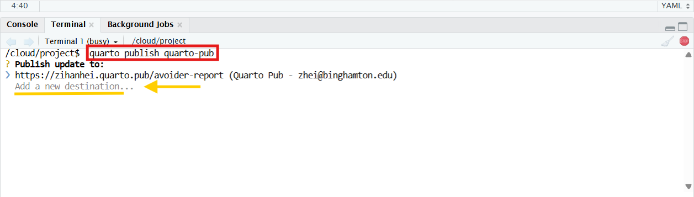
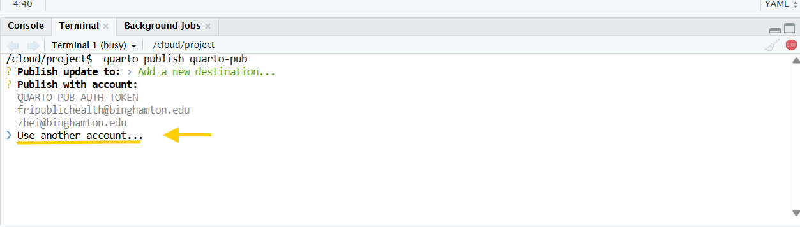
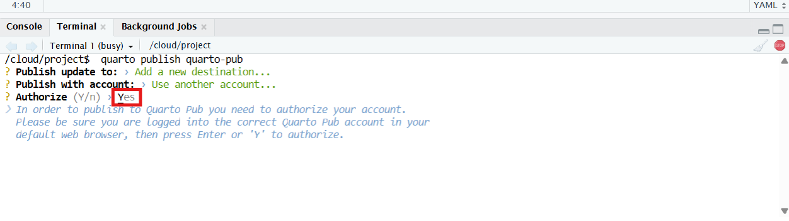
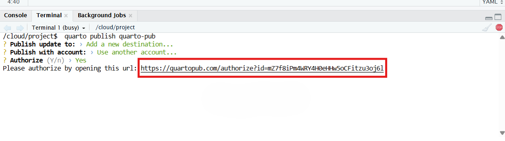
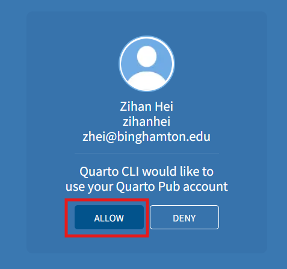
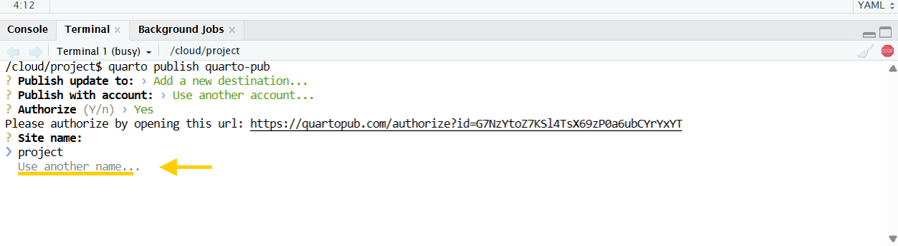
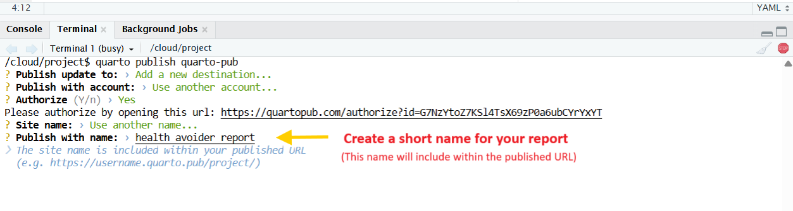



::: {.callout-note collapse="true"}
## Resources

-   [Quarto Publish Guide](https://quarto.org/docs/publishing/quarto-pub.html)
-   [Quarto Pub dashboard](https://quartopub.com/)
:::

::: {.callout-important .required}
## Required: what to submit on Brightspace

You need to submit your *RD Report* and your *Final Report* on Brightspace. Each submission has three parts:

1.  your `.qmd` file (`Lastname_RDreport.qmd` or `Lastname_finalreport.qmd`)
2.  your dataset in `.xlsx` format
3.  a link to your published Quarto report

This chapter shows you how to publish your report and get that link. You can see examples of published Quarto reports in [Reproducible Reports](example.qmd) (Chapter 1).
:::



## Before You Begin

Make sure you have:

-   Your `Lastname_FRI` RStudio Project, with a report (`.qmd`) that renders without errors.

-   An active Quarto account linked to your school Google email.

    -   Sign in to [Quarto pub](https://quartopub.com/) with your school email account using google sign in.

-   Your `_quarto.yml` and `_publish.yml` files are in your `Lastname_FRI` project folder on your computer

    -   You can download these files from [306 Quant Track drive](https://drive.google.com/drive/folders/10AG6VkIKUBODfI4_p84Ozohu0dx3xLa3?usp=share_link)

## Prepare the `_publish.yml` File

In your `_publish.yml` file, add the following code (if not already present):

```{markdown}
- source: project
  quarto-pub:
    - id:                                  # leave the id blank
      url:                                 # leave the url blank
```

⚠️ Do not manually add or paste any token here.

Tokens are automatically handled by Quarto during the publishing process.

------------------------------------------------------------------------

## Publish from the "Terminal"

::: callout-warning
## Caution: The screenshots are from an older setup

The pictures in this chapter were taken in Posit Cloud (RStudio in a web browser), so the Terminal in them shows `/cloud/project`. In RStudio on your computer, the steps and the questions in the Terminal are the same. Only the folder name on the Terminal line is different.
:::

Following the step by step process, and you can publish your report to your own Quarto website!!

### Step 1: Under Terminal

-   Click the tab for Terminal (between the Console and Background Jobs tabs) in RStudio. The line where you type should end with the name of your project folder, `Lastname_FRI`. If it does not, you did not open your project: see [Find the Ref](find-the-ref.qmd).

-   Type the following command and press Enter:

```{markdown}
quarto publish quarto-pub
```

-   Next, When prompted with “Publish update to:”, click **Add a new destination...**

(see the @fig-quartopub below):

{#fig-quartopub}

------------------------------------------------------------------------

### Step 2: Authorize Your Account

-   Under "Publish with account:" section choose "**Use another account...**" (see the @fig-chooseaccount below)

-   Next, the system will ask to authorize your account in order to publish to Quarto Pub. In the Authorize (Y/n) section, type "**Y**" for Yes. (see the @fig-authorize below)

-   Your web browser will then open the Quarto Pub authorization page. (If it does not open by itself, the Terminal shows a link: copy it into your browser.) You will see your Quarto account. Click "ALLOW" to allow publishing. (see the @fig-linktoauthorization and @fig-authorizationpage below)

{#fig-chooseaccount}

{#fig-authorize}

{#fig-linktoauthorization}

{#fig-authorizationpage}

------------------------------------------------------------------------

### Step 3: Name Your Website

-   When prompted for "Site name: ", scroll down to "**Use another name...**" (see the @fig-sitename below)

-   Next, in "Publish with name" section, **enter a short name** for your report. (see the @fig-createname)

    -   different examples:

        -   e.g., zerosum

        -   e.g., safety-report

        -   e.g., avoider-report

    -   Your short name will be in the URL link when you publish (e.g., <https://zihanhei.quarto.pub/avoider-report/>)

{#fig-sitename}

{#fig-createname}

------------------------------------------------------------------------

### Step 4: Confirm and View Your Website

Once publishing completes successfully, you’ll see a message in the terminal with a link to your new Quarto Pub website. Click the link to open your published report!

------------------------------------------------------------------------

## Troubleshooting and Tips

-   If you receive an authorization error, sign out of all Google accounts, then log in again with your school email.

-   To update your site later, simply run:

    ```{markdown}
    quarto publish quarto-pub 
    ```

-   Your `_publish.yml` should **never contain tokens or IDs** you did not generate yourself.

-   To delete a published site, go to your [Quarto Pub dashboard](https://quartopub.com/) and remove it manually.


