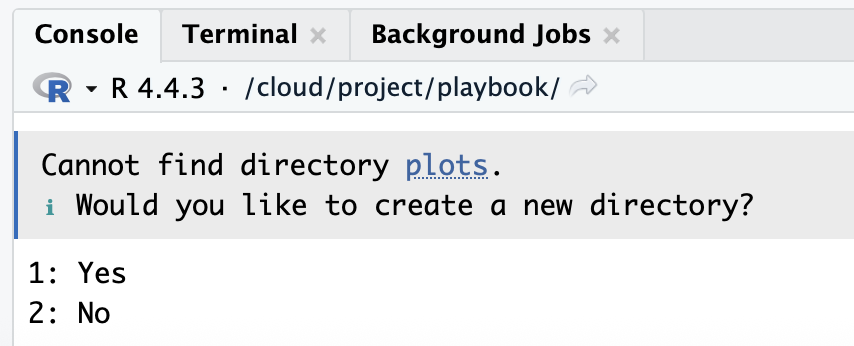
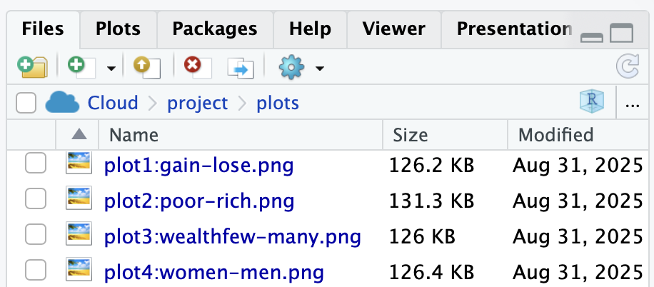



::: {.callout-note collapse="true"}
## Resources: reporting results

-   [Frequentist Inference](statistics.qmd): the four numbers every play reports, and what each one means
-   The Results sentence for each test: [Compare 2 Groups](compare2groups.qmd), [Compare 1 Group, Pre/Post](violin.qmd), [Compare 3+ Groups](ANOVA.qmd), [Relate 2 Variables](correlation.qmd), [Relate 3+ Variables](regression.qmd)
-   [APA Style: numbers and statistics](https://apastyle.apa.org/style-grammar-guidelines/numbers-statistics) (how to format *p*, *t*, *M*, *SD*)
-   [Start My Report](start-rdreport.qmd): the five required parts of every chunk, and when to show or hide output
:::

## What a Results section is for

The Results section reports **what you found**. It does not explain what the findings mean, whether they agree with the literature, or what the team should do next; all of that belongs in the Discussion. A reader of your Results should be able to see, for each research question, the plot, the numbers, and one sentence that says what happened, and then move on.

Write it in the **past tense**, because it describes analyses you ran. Organize it the same way as your Data Analysis Plan ([Write the Methods](methods.qmd)): one subsection per research question, in the same order, with the same names for the variables. If the plan says research question 2 was a two-group comparison of `WELLBEING` by `TREATED_01`, the reader expects a subsection with that comparison, that plot, and that test.

::: {.callout-important .required}
## Required: one block per research question

For **every** research question in your *RD Report* and *Final Report*, the Results section contains, in this order:

1.  **The figure**, made with the play that matches the box on the Analysis Map, with a `fig-cap` that starts "Figure 1." and can stand alone, a `fig-alt`, and `ggsave()`.
2.  **The descriptives**: how many people were in the analysis (the *n* after missing answers were dropped), and the mean and standard deviation (or the median) of the outcome for each group or variable.
3.  **The assumption check**: whether the outcome (or the residuals, for regression) was normal or not, and therefore which line of the box you took ([Describe Your Data](describe.qmd)).
4.  **The four numbers** from the test: the test statistic, the *p*-value, the confidence interval where R gives one, and the effect size ([Frequentist Inference](statistics.qmd)).
5.  **One sentence** in the form the test chapter gives, that states the direction in plain words ("scored lower than", "increased from", "was positively associated with") and says whether the hypothesis was supported.

The test chapters each have a Required box with the exact list for that test; this box is the general rule.
:::

::: callout-important
## Important: what I look for when I read a Results section

-   **The numbers match the plot.** If the plot shows two bars of about the same height, the text should not say the groups differed.
-   **The test matches the plan.** The test named in the Data Analysis Plan is the test in Results. If you changed your mind after seeing the data, say so in Methods and say why; do not pick the test that gives the result you wanted ([Caution: Don't pick the test](describe.qmd)).
-   **Every *p* has an effect size next to it.** A *p*-value says whether a difference is likely to be real; the effect size says whether it is big enough to matter. A result with only a *p* is half a result.
-   **"Not significant" is a result.** Report it with the same four numbers and the same care. Do not leave a research question out because nothing was found.
-   **The code is visible**, with the `#source:` and `#explanation:` comments, and nothing else is: no `head()`, `names()`, or `View()` output, no package startup messages, no warnings you have not read ([When to Show and When to Hide](start-rdreport.qmd#sec-show-hide)).
-   **No interpretation.** "Men scored higher than women" is a result. "Men scored higher than women, which suggests that..." is Discussion.
:::

## Save every plot with `ggsave()`

Every figure in your report is also an image file, because the plots go on your team's poster. The code that makes this happen is [ggsave( )](https://ggplot2.tidyverse.org/reference/ggsave.html), a function that saves a plot as a `.png` (or `.jpg`) image file inside your RStudio Project folder. The pattern is the same for every plot: print it, then save it. Here it is for the histogram from [Coding a Plot](layers.qmd):

```{r}
#| label: ggsave-example
#| eval: false
print(plot1_charges_histogram)
ggsave("plots/plot1_charges_histogram.png",
       plot = plot1_charges_histogram,
       width = 8, height = 5, dpi = 300)
```

And as a template for your own plots:

```{r}
#| label: ggsave-pattern
#| eval: false
print(plot1_SWAPNAME)
ggsave("plots/plot1_SWAPNAME.png",
       plot = plot1_SWAPNAME,
       width = 8, height = 5, dpi = 300)
```

::: {.callout-important .required}
## Required: `ggsave( )`

Your *RD Report* and *Final Report* must include `ggsave( )` for plots, because you will want to easily export these plots and then add them onto your team poster. This is the chapter where you do it, with the plots you make from your team's real dataset. Here is how it works:

The use of `plots/` in the `ggsave()` code chunk saves the image into a folder called **plots** inside your project. If you do not have a **plots** folder yet, the console will ask you whether to create it: type "1" and click return/enter.

In your **files tab**, click the **plots** folder to see your saved images.

Then, upload the plot (and your other plots) to your **TEAM DRIVE: Team Survey Data folder** \> Quant Data \> Plots. The image file is in the **plots** folder inside your `Lastname_FRI` project folder on your computer.

{fig-alt="a screenshot of the console output after running the ggsave code"}

{fig-alt="a screenshot of the files tab showing the saved image files inside the plots folder"}
:::

::: callout-warning
## Caution: the screenshots above are older than the naming rules

The two screenshots were taken before this playbook settled its plot naming convention, so the file names in them are slightly different from what you should write (and the second one even shows the colon mistake described next). Follow the rules in this box and the Go box below, not the screenshots.

Use letters, numbers, underscores (`_`), and hyphens (`-`) only: `plot1_charges_histogram.png` or `plot1-charges-histogram.png`. Do not use spaces, colons, or slashes in a file name. Some computers cannot save or open those files. In this playbook the convention is the underscore form, `plot#_variables_type.png`, so that the file name and the plot object can be spelled the same way.
:::

::: callout-tip
## Go: name every plot `plot#_variables_type`

The file and the object get the same name, in three parts: the figure number, the variables (outcome first, then the group or predictor), and the kind of plot: `plot1_wellbeing_treated_barplot`, `plot2_stigma_helpseek_scatter`, `plot3_effsafe_prepost_raincloud`. Lowercase, underscores, no spaces. The number matches "Figure 1", "Figure 2" in the caption, so the person building the poster can find each file without opening your report, and the chunk label is the same name with hyphens (`plot1-wellbeing-treated-barplot`).

```{r}
#| label: plot-name-pattern
#| eval: false
plot1_wellbeing_treated_barplot <- ggplot(...) + ...
print(plot1_wellbeing_treated_barplot)
ggsave("plots/plot1_wellbeing_treated_barplot.png",
       plot = plot1_wellbeing_treated_barplot,
       width = 8, height = 5, dpi = 300)
```
:::

## Find your plots for the team poster

Every `ggsave()` call writes an image file into the **plots** folder of your project, and those files are what go on the team poster. To get them:

1.  In RStudio's **Files** tab (bottom right), click **plots**. You should see one `.png` per figure, named `plot1_…`, `plot2_…`, in the order of your report. If a plot is missing, its `ggsave()` line did not run: find the chunk, run it, and click the refresh icon at the top right of the Files tab.
2.  Open the folder on your computer: in the Files tab, click the gear icon labeled **More** and choose **Show Folder in New Window**. The `plots` folder opens in Finder (Mac) or File Explorer (Windows), inside `Lastname_FRI`.
3.  Upload the files to your **TEAM DRIVE: Team Survey Data folder** \> **Quant Data \> Plots**. Keep the file names as they are, so your teammates can match each image to the figure number in your report, and so a plot you re-save later replaces the old one instead of sitting next to it.
4.  On the poster, insert the image file itself (Insert \> Image in Google Slides), not a screenshot of the rendered report: the saved file is 8 by 5 inches at 300 dots per inch, which prints sharp at poster size, while a screenshot does not.

If the plot looks different on the poster than in your report, check that you saved the **object** (`plot = plot1_wellbeing_treated_barplot`) and not whatever was last drawn; the Go box above shows the pattern.

## Tables

A table is the right choice when there are more numbers than one sentence can hold: the descriptives for three or more groups, or the coefficients of a regression. Make it with `knitr::kable()` and give it a caption that starts "Table 1." and can stand alone, the same rule as for figures ([Relate 3+ Variables](regression.qmd) shows one).

## The Results checklist

Run down this list for **each** research question before you submit. Then run the plot checklist below it for each figure.

| ☐ | Criteria | Ask yourself |
|----|----|----|
| ☐ | **Order** | Is there one subsection per research question, in the order of the Data Analysis Plan, using the same variable names? |
| ☐ | **Figure first** | Does the block open with the figure, and does the text point to it ("Figure 1 shows ...")? |
| ☐ | **n** | Is the number of people in the analysis reported, after missing answers were dropped (`nobs()` for a model; the *n* per group otherwise)? |
| ☐ | **Descriptives** | Are the mean and *SD* (or the median) reported for each group or variable? |
| ☐ | **Assumption** | Does the text say whether the outcome was normal or not, and does the test match that line of the box? |
| ☐ | **Four numbers** | Test statistic, *p*, confidence interval (where R gives one), effect size: are all four there? |
| ☐ | **Direction** | Does the sentence say which group was higher, or whether the relationship was positive or negative, in plain words? |
| ☐ | **Hypothesis** | Does the block end by saying whether the hypothesis was supported? |
| ☐ | **Past tense** | Is every sentence about an analysis you ran, not one you plan to run? |
| ☐ | **No interpretation** | Have you saved "which suggests", "because", and "this means" for the Discussion? |
| ☐ | **Code shown** | Is the code visible with its `#source:` and `#explanation:`, and are check chunks (`head()`, `names()`) removed or hidden? |
| ☐ | **Composites** | Is Cronbach's alpha for each composite reported in Methods, not here ([Creating Composites](composite.qmd))? |
| ☐ | **Tables** | Does every table have a caption that starts "Table 1." and can stand alone? |
| ☐ | **Plots saved** | Is every figure saved with `ggsave()` into `plots/`, with a numbered file name, and uploaded to the team Drive? |

### The plot checklist




