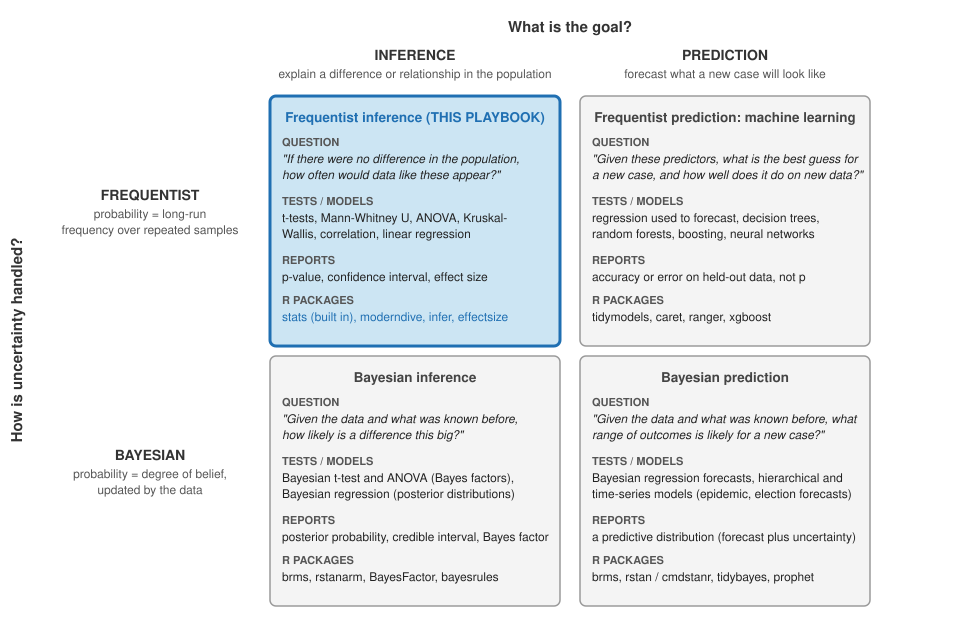

This playbook is not a statistics course. The [Analysis Map](analysis-map.qmd) tells you **which** test fits your research question, and the chapters that follow show you **how** to run it in R. This short chapter answers a different question: **where** do those tests sit in the much larger world of statistics, and what do the numbers they produce mean? Knowing that helps you read a journal article that uses a different approach, describe your own approach in a Methods section, and recognize when a question needs a tool this playbook does not have.

## Two questions locate every statistical approach

Statisticians disagree about many things, but two distinctions sort most of the field. They are independent of each other, so together they make a two-by-two, and every play in this playbook sits in one cell of it.

**What is the goal: inference or prediction?** *Inference* uses a sample to say something about the population it came from: is stigma related to help-seeking? The result is a claim about a difference or a relationship, with a statement of how confident you can be in it. *Prediction* builds a model that forecasts new cases as accurately as possible (will this patient be readmitted, how many people will visit the clinic next month) and judging it by how well it predicts data it has not seen, not by whether its coefficients are "significant". Leo Breiman ([2001](https://doi.org/10.1214/ss/1009213726)) called these the two cultures of statistical modeling. Every research question in this course is an inference question.

**How is uncertainty handled: frequentist or Bayesian?** A *frequentist* treats probability as a long-run frequency: if you repeated the study many times, how often would a difference this large appear by chance alone? That is what a p-value and a confidence interval answer. A *Bayesian* treats probability as a degree of belief that is updated by data: start from what was believed before the study, add the evidence, and report the resulting probability that the difference is real or that it lies in a given range. Both answer the same research questions. However, they word the answer differently and make very different assumptions. Nearly all of the public health and social science literature you will read in this course, and every test on the Analysis Map, is frequentist.

{fig-alt="A two-by-two grid. Columns: Inference (explain a difference or relationship in the population) and Prediction (forecast what a new case will look like). Rows: Frequentist (probability as long-run frequency over repeated samples) and Bayesian (probability as degree of belief updated by the data). Each cell lists a question, tests or models, what is reported, and R packages. Each cell ends with its R packages. Frequentist inference, shaded blue and labeled This Playbook, asks: if there were no difference in the population, how often would data like these appear? Tests: t-tests, Mann-Whitney U, ANOVA, Kruskal-Wallis, correlation, linear regression; reports p-value, confidence interval, effect size; packages stats, moderndive, infer, effectsize. Frequentist prediction (machine learning) asks: given these predictors, what is the best guess for a new case and how well does it do on new data? Models: regression used to forecast, decision trees, random forests, boosting, neural networks; reports accuracy on held-out data; packages tidymodels, caret, ranger, xgboost. Bayesian inference asks: given the data and what was known before, how likely is a difference this big? Models: Bayesian t-test and ANOVA with Bayes factors, Bayesian regression with posterior distributions; reports posterior probability, credible interval, Bayes factor; packages brms, rstanarm, BayesFactor, bayesrules. Bayesian prediction asks: given the data and what was known before, what range of outcomes is likely for a new case? Models: Bayesian regression forecasts, hierarchical and time-series models; reports a predictive distribution; packages brms, rstan or cmdstanr, tidybayes, prophet."}

So when a Methods section asks you to describe your approach, the one-sentence answer is: *frequentist inferential statistics, with the test chosen by the research question and the distribution of the outcome* ([Analysis Map](analysis-map.qmd), Your Turn).

::: {.callout-note collapse="true"}
## Resources: one group for each cell of the figure

Each group is a ladder in the same order: **Start here** is the shortest way in (a course or a short article you can finish in a sitting), **Main text** is the free book to work through, and **Go further** is for when you want the full treatment or the original argument.

**The figure itself**

-   Start here: Wasserstein, R. L., & Lazar, N. A. (2016). The ASA statement on p-values: Context, process, and purpose. *The American Statistician, 70*(2), 129–133. <https://doi.org/10.1080/00031305.2016.1154108> (six principles on what a p-value is and is not; the clearest short statement of the frequentist row)
-   Go further: Breiman, L. (2001). Statistical modeling: The two cultures. *Statistical Science, 16*(3), 199–231. <https://doi.org/10.1214/ss/1009213726> (the inference / prediction columns)
-   Go further: Wagenmakers, E.-J., Marsman, M., Jamil, T., Ly, A., Verhagen, J., Love, J., Selker, R., Gronau, Q. F., Šmíra, M., Epskamp, S., Matzke, D., Rouder, J. N., & Morey, R. D. (2018). Bayesian inference for psychology. Part I: Theoretical advantages and practical ramifications. *Psychonomic Bulletin & Review, 25*(1), 35–57. <https://doi.org/10.3758/s13423-017-1343-3> (the frequentist / Bayesian rows, argued from the Bayesian side)

**Frequentist inference (this playbook)**

-   Start here: [Introduction to Statistics in R](https://www.datacamp.com/courses/introduction-to-statistics-in-r) (DataCamp course)
-   Start here: [Understanding p-values through simulation](https://rpsychologist.com/pvalue/) (Kristoffer Magnusson's interactive page; see the Go box in the next section)
-   Main text: Çetinkaya-Rundel, M., & Hardin, J. [*Introduction to Modern Statistics*](https://openintrostat.github.io/ims/) (free online textbook from OpenIntro; Chapters 11–14 are the inference in this playbook)
-   Main text: Ismay, C., Kim, A. Y., & Valdivia, A. (2025). [*Statistical Inference via Data Science: A ModernDive into R and the Tidyverse*](https://moderndive.com/v2/) (2nd ed.). CRC Press. (free online; the same tests in tidyverse code, with the `moderndive` and `infer` packages; also used in [R Packages](library.qmd) and [Relate 3+ Variables](regression.qmd))
-   Go further: Batra, N., et al. (2021). [*The Epidemiologist R Handbook*](https://www.epirhandbook.com/en/) (free online handbook for applied epidemiology and public health; the reference to keep open after this course)

**Frequentist prediction (machine learning)**

-   Start here: [Modeling with tidymodels in R](https://app.datacamp.com/learn/courses/modeling-with-tidymodels-in-r) (DataCamp course)
-   Start here: [Machine Learning with caret in R](https://app.datacamp.com/learn/courses/machine-learning-with-caret-in-r) (DataCamp course; caret is the older, widely used alternative to tidymodels)
-   Main text: Kuhn, M., & Silge, J. (2022). [*Tidy Modeling with R*](https://www.tmwr.org/). O'Reilly. (free online; the tidymodels packages, in the same pipe-and-tibble style as this playbook)
-   Main text: James, G., Witten, D., Hastie, T., & Tibshirani, R. (2021). [*An Introduction to Statistical Learning with Applications in R*](https://www.statlearning.com) (2nd ed.). Springer. (free PDF on the book's website; the standard first textbook)
-   Go further: Molnar, C. (2025). [*Interpretable Machine Learning: A Guide for Making Black Box Models Explainable*](https://christophm.github.io/interpretable-ml-book/) (3rd ed.). (free online; how to explain what a predictive model learned)

**Bayesian inference**

-   Start here: Etz, A., Gronau, Q. F., Dablander, F., Edelsbrunner, P. A., & Baribault, B. (2018). How to become a Bayesian in eight easy steps: An annotated reading list. *Psychonomic Bulletin & Review, 25*(1), 219–234. <https://doi.org/10.3758/s13423-017-1317-5> (a reading list with the order to read it in)
-   Main text: Johnson, A. A., Ott, M. Q., & Dogucu, M. (2022). [*Bayes Rules! An Introduction to Applied Bayesian Modeling*](https://www.bayesrulesbook.com/). CRC Press. (free online; written for students who know the tidyverse; the `bayesrules` package)
-   Main text: Kruschke, J. K. (2015). *Doing Bayesian Data Analysis: A Tutorial with R, JAGS, and Stan* (2nd ed.). Academic Press. (the "puppies" book; the gentlest full textbook)
-   Go further: McElreath, R. (2020). *Statistical Rethinking: A Bayesian Course with Examples in R and Stan* (2nd ed.). CRC Press. (free [lectures on YouTube](https://www.youtube.com/@rmcelreath); the deepest of the three)

**Bayesian prediction**

-   Start here: Johnson, Ott, & Dogucu (above), Unit IV: posterior prediction and model evaluation, where Bayesian inference turns into Bayesian forecasting
-   Main text: McElreath (above), the chapters on model comparison and out-of-sample prediction
-   Go further: [Stan documentation and case studies](https://mc-stan.org/users/documentation/) (the engine behind `brms`, `rstan`, and `cmdstanr`)
-   Go further: [Prophet](https://facebook.github.io/prophet/) (Bayesian time-series forecasting in R, with a short quick-start)
:::

::: callout-tip
## Go: a third distinction you already know

Before inference comes **description**. The means, standard deviations, counts, and histograms in [Describe Your Data](describe.qmd) are *descriptive statistics*: they summarize the sample you have and make no claim beyond it. Every play starts with description and then makes one inferential step. A report that stops at description is incomplete; a report that skips it is untrustworthy.
:::

## The four numbers every play reports

Every test on the Analysis Map produces the same four kinds of number, and the Results sentences in [Compare 2 Groups](compare2groups.qmd), [Compare 1 Group, Pre/Post](violin.qmd), [Compare 3+ Groups](ANOVA.qmd), and [Relate 3+ Variables](regression.qmd) report them in the same order. Here is what each number tells you, and the mistake to avoid when reading it.

**The test statistic** (*t*, *U*, *V*, *F*, *H*, *r*, *b*) is a single number that summarizes how far the data are from what "no difference" or "no relationship" would look like, measured in units of the data's own noise. Bigger means further. On its own it is hard to interpret, which is why it is always followed by the next number.

**The p-value** is the probability of a test statistic at least this large *if there were really no difference in the population*. A small p (below .05 by the convention in this course) means the data would be surprising under "no difference", so you reject that possibility. Two misreadings to avoid: p is **not** the probability that there is no difference, and it is **not** the probability that the result is a fluke. And a p above .05 does **not** show that the groups are the same; it shows that this sample was not large or clear enough to tell. Write "did not differ significantly", never "were the same".

::: callout-tip
## Go: watch a p-value happen

Kristoffer Magnusson's [interactive p-value simulation](https://rpsychologist.com/pvalue/) draws sample after sample from a population where the true difference is whatever you set, and shows where each sample's test statistic lands. Set the true effect to zero and watch about 5% of samples cross the .05 line anyway (that is a false positive); set it to a small effect with a small sample and watch how often the real difference is missed. Ten minutes with it will do more for your reading of p-values than any paragraph, including the one above.
:::

**The confidence interval** (CI) is the range of population values the data are consistent with. In the lab dataset, people who have had mental health treatment and people who have not differ in well-being (`WELLBEING`, 1 to 5) by 0.03 points, with a 95% CI from −0.17 to 0.23: the true difference could plausibly be anywhere from a little lower to a little higher, including zero. A CI that includes zero always goes with a p-value above .05 (here *p* = .76), and a CI that excludes zero always goes with a p-value below .05; the two never disagree. The CI is more informative than p because it shows how large or small the difference might be. Report it when the chapter's output gives one.

**The effect size** is the size of the difference between groups (Cohen's *d* for two groups, *d~z~* for the same people measured twice, η² for three or more groups, and *r* for the rank-based tests) or of a relationship (*r* for a correlation, *R*² for a regression) in standard units, independent of the sample size. This is the number that answers your research question. With a large sample, a tiny difference can have a very small p-value; with a small sample, a large difference can miss .05. Each chapter gives the conventional labels (small, medium, large), and the Required box in every chapter asks for the effect size for exactly this reason.

::: callout-warning
## Caution: significant does not mean important, and not significant does not mean nothing

"Significant" in a Results section means only "p below .05". A significant difference of 0.1 points on a 1-to-6 scale is real but may not matter to anyone. A non-significant difference in a sample of 40 may matter a great deal and simply need a larger study. Let the effect size and the confidence interval carry the interpretation, and let the p-value say only whether the sample was clear enough to detect it.
:::

## Two things the plays assume

**The sample stands for a population.** A p-value or confidence interval is a statement about the population your sample was drawn from. If your team recruited in a campus dining hall, that population is students who eat there, not all Binghamton students, and not the community. Say in your Methods who the sample represents, and in your Discussion who it does not.

**Enough people in every group.** Two kinds of error are always possible: calling a difference real when it is not (a false positive, Type I, which the .05 threshold holds at 5%), and missing a difference that is there (a false negative, Type II). The second depends on **power**, which rises with the sample size and the effect size. This is why every checklist in the comparison chapters asks for at least 20 people per group, why the [Compare 2 Groups](compare2groups.qmd) Play 2 Caution warns about violins drawn from a handful of people, and why a null result in a small sample is a reason to recommend a larger study, not to conclude that nothing is there.

## Where this chapter came from

The two outer cells of the figure draw on readings from two statistics workshops that I recommend to other social and behavioral scientists:

-   *Machine learning: Uncovering hidden structure in data* (May 19–23, 2025), [Professor Christopher Hare](https://ps.ucdavis.edu/people/christopher-hare), [ICPSR Summer Program in Quantitative Methods](https://www.icpsr.umich.edu/web/pages/sumprog/), University of Michigan.
-   *Getting started with Bayesian statistics* (June 2–4, 2025), Professors Andrew Cohen and Jeff Starns, [ISSR Summer Methods Workshops](https://www.umass.edu/social-science-research/), University of Massachusetts Amherst.
